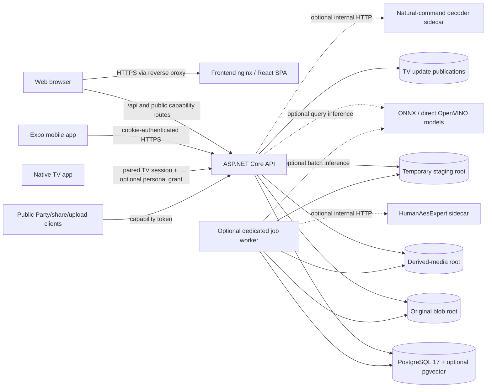

# NubArca Architecture

> **Architecture baseline:** NubArca **0.3.0**
> **Repository snapshot:** `main`, reviewed on 2026-07-27
> **Document role:** authoritative architectural description of the implementation currently present in this repository.

## 1. Authority, scope, and reading rules

The repository is the source of truth for NubArca 0.3.0. This document describes the architecture implemented by:

- `src/NubArca.Api/` — backend, CLI, worker, persistence, storage, media, AI, TV, and bounded contexts;
- `frontend/` — authenticated web application and public browser surfaces;
- `tv/` — native React Native TV application;
- `mobile/` — authenticated read-only mobile gallery application;
- `deploy/`, root Compose files, and scripts — production topology and operational tooling;
- `tests/NubArca.Api.Tests/`, frontend tests, and TV tests — executable contracts and safety regressions;
- EF Core migrations and entity configurations — authoritative persisted schema and database constraints.

When comments, historical notes, release-candidate labels, or older documentation disagree with executable code, migrations, configuration, or tests, the executable repository wins. Historical documents such as `CHANGELOG.md`, `DEVELOPMENT_STATE.md`, and `docs/current-work.md` explain evolution; they are not substitutes for the current architecture.

This document intentionally does **not** duplicate the README. It covers system structure, runtime boundaries, data ownership, request and job flows, security invariants, feature maturity, and operational topology.

## 2. Product and deployment model

NubArca is a self-hosted personal cloud optimized for a single server and a small number of trusted users. Its primary responsibilities are:

- owner-scoped files and folders;
- immutable content-addressed storage and exact SHA-256 deduplication;
- photo and video library management;
- albums, public share links, and event-oriented Party albums;
- embedded metadata, media derivatives, video probing, and optional HLS playback;
- resumable browser uploads, server-side imports, photo organization, and archive export;
- optional local AI for photo similarity, semantic retrieval, face processing, and People;
- segregated private or specialist surfaces: Private Vault, Plates, and Aesthetics Lab;
- paired TV access, a PIN-protected Personal Area, native TV media playback, and TV OTA updates.

NubArca is not designed as a horizontally scaled SaaS control plane. The production defaults deliberately target one PostgreSQL instance, one API instance, and at most one active job worker on a personal server. The schema is multi-user and every private operation is owner-scoped, but the authorization model is intentionally simple: authenticated users own their content, and one boolean admin role controls operator functions.

The following are not current product capabilities:

- WebDAV or filesystem synchronization clients;
- public user registration;
- collaborative document editing or complex ACLs;
- calendar, contacts, mail, or chat;
- generic plugins or arbitrary third-party code execution;
- DASH generation;
- a distributed multi-worker scheduler with resource-aware routing;
- completed document extraction, document embedding, or automatic tagging pipelines. Schema and job seams exist for these AI capabilities, but their handlers remain skeleton/no-op paths in 0.3.0.

## 3. Architectural principles and non-negotiable invariants

### 3.1 The logical tree is database-owned

Folders, names, parent relationships, deletion state, album membership, Vault membership, and user metadata exist in PostgreSQL. The physical blob store is not a browsable user filesystem and does not encode the logical hierarchy.

Rename, move, album operations, media-library exclusion, and Vault move-in/move-out are database operations. They do not rename, copy, or rewrite original blob bytes.

### 3.2 Original bytes are immutable

A `BlobObject` identifies immutable content by SHA-256. No operation mutates a stored original in place. Operations that alter downloadable bytes—embedded-metadata stripping and DateTaken writeback are the canonical examples—produce a new blob, repoint the logical file inside a transaction, update reference counts, and preserve the old blob for any remaining references.

### 3.3 Ownership is enforced before projection

Private queries combine object identity, `OwnerUserId`, active/deleted state, and bounded-context visibility in one database predicate. Missing, deleted, hidden, and foreign objects converge on the same not-found behavior where appropriate. API DTOs are projected in the query and omit internal identifiers and paths.

### 3.4 Content identity and user intent are separate

Blob-derived facts are shared by all logical references to the same bytes. User-entered metadata, folder placement, favorites, album membership, exclusion state, Party moderation, and face-to-person decisions are owner-scoped and never propagate through deduplication.

### 3.5 Derived data is regenerable

Thumbnails, medium previews, posters, preview strips, HLS ladders, face crops, embeddings, clusters, ALPR results, and aesthetic results are derived artifacts. Their persistence and retention vary by subsystem, but none is the authoritative copy of an original file.

### 3.6 Public access is capability-scoped

Unauthenticated access is granted only through narrowly scoped random capabilities: file share tokens, Party tokens, Party upload/search sessions, and Beauty Lab upload tokens. Raw tokens are returned only at creation/activation boundaries; persisted rows contain hashes or derived keys. A public capability never becomes a general authenticated session.

### 3.7 Private bounded contexts are exclusion-first

Private Vault content is removed from normal EF queries through global query filters. Plates and Aesthetics Lab use standalone entities rather than `FileItem`, preventing accidental inclusion in Files, Gallery, People, Party, TV, Vault, search, or normal sharing. Boundary enforcement is structural, not merely a UI convention.

### 3.8 Expensive work is explicit and durable

Long or failure-prone operations use the PostgreSQL-backed job queue. Jobs are leased, heartbeated, retryable, cancellable, progress-reporting, and—where implemented—cooperatively sliceable. The API may lazily enqueue work, but it does not pretend that queued work has completed.

### 3.9 Optional capabilities fail closed

AI, HLS, server imports, staged uploads, cleanup sweepers, startup migrations, Aesthetics analysis, and model-backed Plates analysis are controlled by configuration. Missing models, sidecars, binaries, or feature flags make the capability unavailable or no-op; they do not silently substitute an unsafe external service.

## 4. System context and runtime topology



### 4.1 Production Compose topology

The production Compose file defines four services:

| Service | Role | Exposure |
|---|---|---|
| `postgres` | PostgreSQL 17 with the pgvector extension available | Internal network only; no published port |
| `api` | ASP.NET Core HTTP API, CLI-capable image, lazy media generation | Bound to `127.0.0.1:8080`; expected behind a host reverse proxy |
| `frontend` | Static React SPA served by nginx | Bound to `127.0.0.1:8081`; expected behind the same reverse proxy |
| `worker` | Optional `jobs worker` process using the API image | Disabled unless the `worker` Compose profile is enabled |

The Compose stack does not terminate TLS. The host reverse proxy owns TLS and forwards only to loopback-bound API/frontend ports. PostgreSQL remains on the internal Docker network.

Named or bind-backed storage separates:

- PostgreSQL data;
- original blob storage;
- optional derived storage;
- temporary staged-upload data;
- ASP.NET Core Data Protection keys;
- TV update publications.

The API and worker must receive matching storage, media-provider, staging, job, AI, and model configuration. A worker with different roots or providers would observe a different system and is therefore an invalid deployment.

### 4.2 Worker modes

Exactly one of these execution modes should process durable jobs on the 0.3.0 single-server topology:

1. in-process hosted worker with `Jobs:WorkerEnabled=true`;
2. dedicated Compose `worker` profile running `jobs worker`;
3. operator-driven `jobs run-once` invocations.

The default deployment guidance is one active worker process and `Jobs:MaxConcurrentJobs=1`. Lease/heartbeat recovery protects against a crashed process, but 0.3.0 does not claim a general multi-worker, multi-resource scheduler. The explicitly configured OpenVINO `DUAL:CPU,GPU` image mode is a narrow exception: it uses two job slots inside the same worker process to feed a bounded CPU/GPU tandem and does not change the queue's single-server ownership model.

### 4.3 Optional inference overlays

The root Compose fragments are additive deployment overlays, not independent NubArca stacks:

| Overlay | Runtime effect | Boundary |
|---|---|---|
| `docker-compose.nlu.yml` | Adds the optional natural-command decoder used when the gallery interpreter is configured for the model-backed path | Internal network only, read-only model mount, no published port |
| `docker-compose.human-aesexpert.yml` | Adds the HumanAesExpert service consumed by Aesthetics jobs | Internal network only, read-only model mount, no original/derived blob-store mount, no published port |
| `docker-compose.openvino-direct.yml` | Builds/configures API and worker for in-process OpenVINO execution with independently selected detector, recognizer, and photo-image devices | Model files are mounted read-only; GPU modes map the required device explicitly |
| `docker-compose.facedirect-api.yml` | Applies the pinned complete direct-inference API/worker image configuration for face and SigLIP image/text towers | Separate API/worker compile caches and explicit per-model device placement |

These fragments are selected according to the deployed inference topology and composed with the production stack plus operator-local mounts/configuration. They must not expose inference services publicly, download model weights at request time, or silently mix incompatible profile outputs.

## 5. Repository and deployable units

| Path | Architectural responsibility |
|---|---|
| `src/NubArca.Api/Program.cs` | Composition root, middleware, service registration, minimal API route map, HTTP contracts |
| `src/NubArca.Api/Domain/` | Persisted domain entities and stable domain constants |
| `src/NubArca.Api/Data/` | `AppDbContext`, EF configurations, migrations, database-specific invariants |
| `src/NubArca.Api/Storage/` | Original and derived filesystem stores, content-addressing, physical safety |
| `src/NubArca.Api/Files/`, `Folders/`, `Metadata/`, `Media/`, `MediaLibrary/`, `Albums/` | Core owner library and media query model |
| `src/NubArca.Api/Jobs/` | Durable queue, processor, worker, scheduling and job contracts |
| `src/NubArca.Api/Ingestion/`, `Uploads/`, `Organizer/`, `PhotoExport/` | Import, resumable staging, organization, and export workflows |
| `src/NubArca.Api/Ai/` | AI profiles, providers, local inference, photo and face pipelines, diagnostics |
| `src/NubArca.Api/Party/`, `Tv/`, `TvUpdates/` | Public event albums, paired TV projections, Personal Area, OTA publications |
| `src/NubArca.Api/Vault/` | Private Vault authentication and exclusion-first logical moves |
| `src/NubArca.Api/Plates/` | Segregated ALPR and privacy-redaction domain |
| `src/NubArca.Api/Aesthetics/` | Segregated HumanAesExpert/Beauty Lab domain |
| `frontend/` | React web application, public Party/upload pages, browser TV fallback |
| `mobile/` | Expo authenticated read-only gallery client |
| `tv/` | Native React Native TV client, pairing/personal state machine, media cache, OTA |
| `tests/NubArca.Api.Tests/` | Service, endpoint, security, storage, scheduler, integration, and regression tests |
| `deploy/` and `scripts/` | First deployment, production validation, backup/restore, model and TV publication tooling |

## 6. Technology stack

### 6.1 Backend

- ASP.NET Core minimal API targeting `.NET 10`;
- EF Core 10 with `Npgsql.EntityFrameworkCore.PostgreSQL`;
- PostgreSQL 17; production image includes pgvector;
- cookie authentication and ASP.NET Core Identity password hashing;
- built-in ASP.NET Core rate limiting;
- `MetadataExtractor` for embedded metadata;
- ImageSharp plus a libvips/NetVips fast path for image derivatives;
- FFmpeg/ffprobe process integration for video posters, preview strips, metadata, and optional HLS;
- ONNX Runtime, Hugging Face tokenizer support, and optional direct OpenVINO execution for local AI;
- hosted services for explicitly enabled background loops and runtime/model readiness.

### 6.2 Web frontend

The web client uses React, TypeScript, Vite, React Router, `@tanstack/react-virtual`, `hls.js`, and QR generation. The main route tree includes:

- Files home, Trash, Shares, Albums, Party moderation;
- unified Media workspace with active and excluded scopes;
- Similar Photos and People;
- Plates and Aesthetics Lab;
- Private Vault;
- resumable Upload and Cloud Functions;
- TV pairing/device management and browser TV mode;
- admin storage, import, and jobs pages;
- public Party, Party upload, and Beauty Lab upload pages.

Legacy `/gallery` and `/videos` routes redirect into the unified `/media` workspace while preserving compatible query state.

`/cloud-functions` is a presentation-level hub for existing owner-private bulk workflows—staged upload, DateTaken organization, photo export, and Private Vault access. It is not a Function-as-a-Service runtime, plugin host, or separate execution boundary.

### 6.3 Mobile client

`mobile/` is an Expo/React Native client with a deliberately small state machine:

- restore a persisted cookie from secure storage;
- validate it through `/api/auth/me`;
- show login when absent or expired;
- show the authenticated read-only gallery when valid.

It is not a synchronization agent and does not mirror the full web feature set.

### 6.4 TV client

`tv/` is an Expo/React Native TV application based on `react-native-tvos`. It uses an explicit reducer-driven flow rather than a general navigation framework:

```text
pairing -> mode selection -> Party
                         \-> Personal PIN -> Personal Home
                                           -> Gallery / Videos / Beauty Lab
```

The native client persists only the limited TV session cookie. Personal unlock authority is held in memory and revalidated periodically. Returning from the Personal Area locks it; changing the owner PIN invalidates existing grants. Media is downloaded through authenticated endpoints into a controlled cache for native rendering. `expo-updates` checks for a published update in the background and applies a downloaded update on a later cold launch rather than disrupting the current session.

## 7. Backend composition and HTTP pipeline

`Program.cs` is the composition root. Database-dependent services are registered only when `ConnectionStrings:Postgres` is present; DB-independent health and middleware paths can therefore start in constrained test or diagnostic hosts.

The effective middleware order is:

1. trusted forwarded headers, when enabled;
2. security response headers including `X-Content-Type-Options: nosniff`;
3. centralized same-origin validation for unsafe API requests;
4. cookie authentication;
5. authorization;
6. rate limiting;
7. minimal API endpoints.

### 7.1 Authentication and roles

- No public registration endpoint exists.
- Users are provisioned through operator CLI paths or, once at least one admin
  exists, through the admin user-management UI/API (`/admin/users`,
  `/api/admin/users/*`) described below.
- Browser/mobile sessions use the standard application cookie.
- The cookie is `HttpOnly`, `SameSite=Lax`, uses the request's secure policy, expires after fourteen days, and slides while active.
- The authenticated principal is revalidated so disabled users and admin-role changes take effect without waiting for a new login.
- Admin routes require the admin policy backed by `User.IsAdmin`.
- Login uses a dummy password-hash verification when the account is absent to reduce user-enumeration timing differences.

Admin user management is UI-backed (`AdminUsersPage` + `AdminUserService`),
not CLI-only: an admin can list/search users, create a user with an initial
password, edit display name/language, reset another user's password, grant or
revoke the admin marker, and enable/disable an account. Every authenticated
user can change their own password (`POST /api/auth/me/password`), which
requires the current password and is distinct from an admin-initiated reset.
`User.IsAdmin` remains a single boolean operator marker, not a role/permission
table — the admin surface adds CRUD and safety guards around that same
column, it does not introduce RBAC. Guardrails enforced by `AdminUserService`:
the last active admin can never be demoted or disabled, and an admin can never
demote or disable their own account (self-service demotion/disable is
disallowed outright, not merely confirmed). Password hashes are never
returned by any endpoint; a shared `PasswordPolicy` (10–256 chars,
not-all-whitespace) gates every password-setting path — admin create, admin
reset, and self-service change alike. Sensitive actions are audited
(`admin.user.*`, `auth.password.change`) with target user id only — never a
password or its hash.

### 7.2 CSRF and proxy trust

`SameSite=Lax` is the primary CSRF control for the JSON SPA. Unsafe `/api` methods additionally pass a centralized `Origin`/`Referer` same-origin check. Deliberately public multipart endpoints disable framework antiforgery but remain protected by capability tokens, size checks, rate limits, and their own validation.

Forwarded headers are not accepted indiscriminately. Production configuration expects a same-host reverse proxy and supports explicit known proxies/networks or an operator-controlled trust-any mode. Remote IP and request scheme are consumed only after forwarded-header processing.

### 7.3 Rate-limit surfaces

Fixed-window, remote-IP-partitioned policies cover at least:

- login;
- public share download;
- photo-export creation;
- Vault setup/unlock;
- TV pairing and Personal unlock;
- Party public reads, media, uploads, and face search;
- semantic search and TV natural-command interpretation;
- Beauty Lab public upload.

The public media policy is intentionally separate from public metadata/listing limits because a slideshow produces many more thumbnail, preview, and segment requests than page navigation.

### 7.4 API surface organization

The backend remains one minimal-API host, but its routes form clear architectural groups:

- `/api/auth`, `/api/storage`, `/api/files`, `/api/folders`, `/api/trash`, `/api/search`;
- `/api/media`, `/api/images`, `/api/videos`, `/api/media-library`;
- `/api/albums`, `/api/share-links`, `/s/{token}`;
- `/api/uploads/staging`, `/api/admin/import`, `/api/admin/jobs`, `/api/admin/storage-stats`;
- `/api/photo-organizer`, `/api/photo-exports`;
- `/api/people`, `/api/admin/ai`;
- `/api/private-vault`;
- `/api/plates`;
- `/api/aesthetics-lab` and `/api/beauty-lab-upload`;
- `/api/party`;
- `/api/tv`, `/api/tv-personal`, `/api/tv-devices`, and TV update endpoints.

The route map is not itself the business layer. Endpoints resolve identity and request contracts, call scoped services, and return sanitized projections or streams.

`Program.cs` remains the application composition root (middleware, DI, rate limiting, route registration order). The endpoint-module extraction is complete: endpoint mappings are split into modules under `src/NubArca.Api/Endpoints/` (`AuthEndpoints`, `AdminUserEndpoints`, `AdminJobsEndpoints`, `AdminImportEndpoints`, `StagingUploadEndpoints`, `PeopleEndpoints`, `AlbumEndpoints`, `PartyEndpoints`, `TvEndpoints`, `PlatesEndpoints`, `AestheticsEndpoints`, `GalleryMediaEndpoints`, `FileEndpoints`, `FolderTrashEndpoints`, `ShareLinkEndpoints`, `PrivateVaultEndpoints`, `PhotoOrganizerEndpoints`, `PhotoExportEndpoints`, `AdminAiEndpoints`), each a `MapXxxEndpoints(this IEndpointRouteBuilder)` extension called from `Program.cs` at the same point the routes used to be defined inline. `AlbumEndpoints` covers only true album CRUD/membership/TV-visibility; `PartyEndpoints` covers both the public `/api/party/*` surface and the album-nested Party routes (`/api/albums/{id}/party-settings`, `/api/albums/{id}/party-uploads/*`); `TvEndpoints` covers TV pairing/session, owner-side TV device management, the TV Personal Area (PIN + TV-session-authenticated personal gallery/videos/media/aesthetics), and TV Party-album browsing/media delivery; `PlatesEndpoints` covers the owner-private Plates (Targhe) surface (upload, gallery import, list/detail/delete, thumbnail/preview/original media incl. face-redacted variants, and ALPR analysis request/status); `AestheticsEndpoints` covers the owner-private Aesthetics/Beauty Lab surface (public TV QR mobile upload plus the owner-facing list/upload/analyze lab); `GalleryMediaEndpoints` covers the unified gallery/media query surface (`/api/images`, `/api/videos`, `/api/media`, `/api/albums/{albumId}/media`); `FileEndpoints` covers FileItem-scoped media delivery (content/thumbnail/preview/video/HLS renditions/poster/video-preview-strip), metadata, privacy-safe download, duplicates, similar-photo search, and the file lifecycle (upload/rename/move/delete/restore); `FolderTrashEndpoints` covers folder listing, Trash, and the folder lifecycle (create/rename/move/delete-preview/delete/restore); `ShareLinkEndpoints` covers owner-side share create/list/revoke plus the public, anonymous, rate-limited `/s/{token}` short-URL download; `PrivateVaultEndpoints` covers the owner-private Vault (v0) status/setup/unlock/lock, browse, move-in/move-out, and vault-scoped derived-media delivery (thumbnail/preview/poster/info) — never original bytes or Range streams; `PhotoOrganizerEndpoints` covers Media Library (gallery membership rules + per-file exclusion) and the owner-scoped date-taken reorganization workflow (dry-run/run/status); `PhotoExportEndpoints` covers the read-only owner-private photo archive export sessions (manifest + per-file original download, cookie-or-bearer-token authorized); `AdminAiEndpoints` covers the admin-only medium-preview derivative rebuild status/trigger and the AI substrate status/diagnostics/face-settings surface — aggregate/status data only, never raw vectors, blob ids, SHA, storage keys, or physical paths. Five endpoints remain intentionally inline in `Program.cs`: `/health` and `/health/ready` (liveness/readiness probes, composition-root infrastructure by nature), `GET /api/storage/me` (owner-scoped usage, `IStorageAccountingService`), `GET /api/admin/storage-stats` (admin-only aggregate counters, `IStorageStatsService` — a distinct, admin-namespaced service, not the same domain as `storage/me` despite the shared word "storage"), and `GET /api/search` (owner-scoped file search). None of the three domain endpoints is large or cohesive enough on its own or paired with another to justify a dedicated module without creating a single-trivial-handler file. This is a modular-monolith cleanup, not a microservices split: one process, one deployable, the same middleware pipeline and DI container.

## 8. Persistence architecture

### 8.1 Database conventions

`AppDbContext` applies explicit entity configurations from the API assembly. Core conventions are:

- GUID primary keys generated by application services;
- UTC timestamps mapped to `timestamp with time zone`;
- explicit indexes and uniqueness constraints for owner-scoped hot paths;
- restrictive foreign keys rather than cascades;
- soft deletion for user library content;
- JSONB for internal structured documents where relational columns are not the correct contract;
- database transactions for multi-row lifecycle changes;
- PostgreSQL advisory transaction locks for conflicting tree mutations by the same owner.

### 8.2 Persisted domains

The current context contains the following logical groups.

| Domain | Principal entities | Ownership and purpose |
|---|---|---|
| Identity and library | `User`, `Folder`, `FileItem`, `BlobObject` | Users own the logical tree; blob rows are global content identities |
| Metadata and media | `BlobMetadata`, `FileItemUserMetadata`, `FileThumbnail`, `BlobHlsDerivative`, `DerivativeDiagnostic`, `FileItemLocation` | Shared byte-derived facts plus owner-specific annotations and regenerable artifacts |
| Sharing and collections | `ShareLink`, `Album`, `AlbumItem`, `AuditLog` | Owner-managed collections, public file capabilities, forensic events |
| Durable operations | `BackgroundJob`, `AdminImportRun`, `AdminImportItem`, `RemoteUploadSession`, `RemoteUploadItem`, `RemoteUploadChunk` | Jobs, persisted import manifests, and staged-upload state |
| Library organization | `MediaLibraryRule`, `PhotoOrganizerRun`, `PhotoOrganizerMove`, `PhotoExportSession`, `PhotoExportEntry`, `OwnerDeletedContentTombstone` | Visibility, deterministic moves, export snapshots, and re-import suppression |
| TV and Party | `TvPairingRequest`, `TvSession`, `TvPersonalPin`, `TvPersonalUnlockGrant`, `PartyAlbumLink`, `PartyUploadItem`, `PartyFaceSearchSession`, `PartyFaceSearchResult` | Limited TV identity, Personal Area authorization, public event capabilities and moderation |
| AI foundation | `AiModel`, `AiProfile`, `BlobAiArtifactStatus`, `BlobEmbedding`, `AiAnnotation`, `AiIndexDiagnostic`, document schema entities | Provider/profile lifecycle, artifact state, vectors, diagnostics, future document/tag seams |
| Face and People | `FaceDetection`, `FaceEmbedding`, `FaceCluster`, `FaceClusterMember`, `Person`, `PersonGroup`, `FaceAssignment`, `PersonFaceAssignment`, `IgnoredFace`, `AiSetting`, `FacePreview` | Blob-level face artifacts plus owner-level grouping, confirmation, ignore state, and display crops |
| Private Vault | `PrivateVault`, `PrivateVaultAccessToken`; `PrivateVaultId` on normal tree rows | Exclusion-first private partition using the normal logical tree and original blobs |
| Plates | `PlateImage`, `PlateAnalysisJob`, `PlateDetection`, `PlateAnalysisModelRun`, `PlateFaceRedactionBox`, `PlateRedactedMedia` | Standalone owner-private ALPR and privacy-redaction domain |
| Aesthetics | `AestheticLabItem`, `AestheticAnalysisRun`, `AestheticMetric`, `AestheticTextResult`, `AestheticLabDerivative`, `AestheticUploadSession` | Standalone opt-in HumanAesExpert domain and short-lived QR upload capabilities |

### 8.3 Ownership model

There are three different ownership classes and they must not be conflated:

1. **global byte identity** — `BlobObject`, `BlobMetadata`, and blob-level embeddings/detections can be shared by references to identical bytes;
2. **owner-scoped logical state** — files, folders, albums, user metadata, People decisions, rules, Party configuration, TV devices, and operations belong to one user;
3. **isolated owner-scoped domains** — Plates and Aesthetics own separate membership rows and never become normal library items.

Global blob-level AI and metadata artifacts do not make a blob publicly discoverable. Every read path starts from an authorized owner-scoped membership or capability-scoped item set.

### 8.4 Tree consistency and concurrency

Active sibling names are unique per owner and parent. Folder and file mutations use a per-owner PostgreSQL advisory transaction lock around read-check-write sequences. This protects:

- concurrent create/rename conflicts;
- reciprocal moves that could create cycles;
- children being moved under deleted or foreign parents;
- folder delete/restore racing with child mutations;
- Vault and media-library projections that must remain tree-consistent.

SQLite tests run through the same service contracts; the advisory lock is a no-op there because test topology is single-connection and PostgreSQL-specific behavior has separate integration coverage.

## 9. Physical storage and content addressing

### 9.1 Original blob store

Original bytes are stored below `Storage:RootPath` using a hash-sharded key derived only from the lowercase SHA-256 digest:

```text
objects/{sha[0..2]}/{sha[2..4]}/{sha256}
```

The write path:

1. streams request or import bytes into a temporary `.part` file;
2. computes SHA-256 incrementally while copying;
3. flushes and closes the temporary file;
4. atomically moves it to the final hash path with overwrite disabled;
5. converts a concurrent same-hash collision into successful deduplication;
6. deletes temporary data on failure or duplicate completion.

Read resolution validates the storage-key format, shard/hash agreement, and final path containment under the configured root. `StorageKey`, absolute paths, SHA values, and blob IDs are internal and are not emitted by normal API DTOs, headers, errors, job progress, or audit records.

### 9.2 Derived store

`Storage:DerivedRootPath` may point to a separate filesystem for regenerable artifacts. When omitted, derived files share the original storage root while remaining logically separated by their storage abstraction.

The API and worker use the same `IDerivedBlobStorage`. Typical derived artifacts include:

- image thumbnails and medium previews;
- video posters and six-frame preview strips;
- HLS playlists and segments;
- face preview crops;
- Plates redacted-media cache;
- Aesthetics thumbnail/preview renditions.

Original and derived bytes share the same `BlobObject` table, content-addressed key format, deduplication model, and reference-count machinery; the storage abstraction determines which physical root resolves a root-relative `StorageKey`. A derivative missing from the derived root may be restored by copying identical bytes from the original root when present there, or regenerated when absent from both roots. The blob janitor deletes a reclaimed object's key from both roots idempotently, and storage reconciliation scans the union so a valid split-root derivative is not misclassified as missing source data.

Derived placement can be audited and repaired independently from original-file lifecycle and remains regenerable cache rather than authoritative user content.

### 9.3 Deduplication and reference counts

`BlobObject.Sha256` is unique. Creating a logical file either:

- attaches to the existing blob and atomically increments `ReferenceCount`; or
- creates the physical object and its blob row, handling a concurrent unique-key race by reloading the winner and removing any redundant physical write.

A successful `FileItem` soft delete atomically marks the logical row and releases the original blob reference exactly once; a repeated delete is a no-op for accounting. Restore increments the original blob reference exactly once. Permanent deletion of an item already in Trash does not release the original a second time: it removes the logical row and dependent records, releasing separately referenced derivative blobs where applicable. The blob janitor is the only normal path that removes zero-reference blob rows and bytes from the physical stores after a configurable grace period.

Reference counts are an accounting invariant, not an unquestioned oracle. The repository includes audit and repair services that compare persisted counts with actual live references.

### 9.4 Quotas and accounting

Per-user quota is logical: the owner is charged for every non-purged `FileItem`, including items in Trash, even when the bytes are globally deduplicated. Permanently deleted rows stop counting; folders and derived artifacts do not count. Physical storage statistics are tracked separately. Upload/import admission uses configured request/file limits, the application upload cap, and owner quota; reverse-proxy limits must be configured consistently because they are outside the application.

Storage reconciliation and statistics distinguish:

- logical active/deleted usage;
- physical original bytes;
- derived bytes;
- orphan or missing objects;
- blob reference-count mismatches;
- derivative failure categories and never-attempted artifacts.

## 10. Core file and folder lifecycle

### 10.1 Creation and upload

All normal ingestion paths converge on the same file/folder/blob invariants. A file creation transaction is responsible for:

- validating owner and destination;
- selecting deterministic conflict behavior;
- persisting or attaching the original blob;
- creating the owner-scoped `FileItem`;
- creating or reusing `BlobMetadata` detection state;
- maintaining reference count and logical quota;
- setting denormalized effective date and media-library inheritance state;
- writing audit information without sensitive storage details;
- enqueueing bounded post-ingestion work when appropriate.

Direct browser uploads retain a synchronous single-file path. Large or remote browser ingestion should use staged upload, described later.

### 10.2 Rename and move

Rename and move do not touch original bytes, derivatives, metadata, shares, album membership, or AI artifacts. They update the logical row under the owner tree lock. Folder move additionally validates against cycles and triggers recomputation of denormalized media-library visibility for the affected owner tree.

### 10.3 Soft delete, Trash, and permanent deletion

Normal deletion marks files/folders with `DeletedAt`. Deleted rows disappear from active queries and appear in owner Trash. For files, the soft-delete transition also releases the original blob reference; Trash rows still count toward the owner's logical quota. Recursive folder deletion invokes the per-file soft-delete path for each active descendant before stamping the folder subtree, preserving reference counts, album/share cleanup, metadata, derivatives, tombstones, and audit semantics.

Restore validates that the destination parent is active and that no active sibling name conflicts. Restoring a file increments its original blob reference; restoring a folder does not implicitly restore all descendant files and folders. Permanent Trash deletion removes the already-soft-deleted logical row and dependent data without decrementing the original blob a second time; separately referenced thumbnail/derivative blobs are released as their rows are removed. A file-item sweeper can hard-delete sufficiently old soft-deleted rows through the same permanent-delete semantics; it is disabled by default and controlled by an explicit grace period.

### 10.4 Deleted-content tombstones

An explicit user-intent soft delete can create an owner-scoped, peppered content fingerprint when the deleted item is the owner's final active occurrence of those exact bytes. Recursive user folder deletion uses the same rule per descendant. Server import consults this ledger to avoid silently re-importing content the same owner deliberately deleted; maintenance or unspecified deletion reasons do not manufacture user intent. The fingerprint secret must be stable and equal on API and worker. Tombstones are owner-specific: one user's deletion never suppresses another user's import.

### 10.5 Search and browser projections

The file browser and name search are owner-scoped and independent from media-library inclusion. Excluding a folder from the Media workspace does not hide it from Files, prevent downloads, change quota, or make it ineligible for explicit share or normal file operations.

Folder children support server-side sorting and seek pagination for large directories. DTOs expose logical identifiers and curated presentation fields only.

## 11. Metadata architecture

### 11.1 Detection, embedded extraction, and user metadata

Metadata has three layers:

| Layer | Storage | Mutability | Scope |
|---|---|---|---|
| Detection facts | `BlobMetadata` | Recomputable from bytes | Global per blob |
| Embedded metadata | typed `BlobMetadata` fields + internal raw JSON | Re-extractable from bytes; not user-editable in place | Global per blob |
| User metadata | `FileItemUserMetadata` | User-editable | Owner per logical file |

Detection identifies trusted content type, media category, format, dimensions, pixel count, and video signature/probe facts. It is server-derived and is the security gate for preview, poster, gallery, and processing eligibility; the client-supplied MIME value is not sufficient.

Embedded image extraction uses `MetadataExtractor` and normalizes curated EXIF, GPS, IPTC, XMP, ICC, maker-note, and format fields. Failures are represented by stable status/error codes rather than raw exception text. The raw structured metadata document is internal and is never serialized by the public metadata DTO.

User metadata includes title, description, tags, rating, favorite state, capture-date override, and location override. It belongs to the `FileItem`, so deduplicated files owned by different users remain independent.

### 11.2 Metadata pipeline V2

Normal browser upload may extract embedded image metadata inline. Server import defaults to a short critical path:

1. persist original bytes and detection facts;
2. create the logical item and manifest outcome;
3. mark full extraction pending;
4. enqueue `metadata.embedded.backfill`.

The backfill is idempotent, version-aware, keyset-paged, checkpointed, cancellable, and cooperative. Each completed blob updates effective capture dates for referencing items and refreshes the owner-private GPS projection.

Video metadata is a separate provider path. With `Media:VideoMetadataProvider=ffprobe`, a bounded external process extracts duration, dimensions, codec/container facts, and related technical metadata. With provider `none`, probing is unavailable and the corresponding job has no real work.

### 11.3 Effective capture date

`FileItem.EffectiveDateTaken` denormalizes the display/order value:

1. user `DateTakenOverride`;
2. embedded blob DateTaken;
3. `FileItem.CreatedAt` as the upload/import fallback.

Write paths keep this column synchronized; a maintenance command/job can recompute it. Gallery date ordering and organization queries use the denormalized column rather than reconstructing the merge for every row.

### 11.4 GPS projection and exposure policy

`FileItemLocation` projects coordinates from shared blob metadata into an owner/file-scoped row because visibility depends on owner membership, deletion, Vault state, and media-library state. It is maintained during extraction, dedup attachment, byte-repoint operations, and permanent deletion.

Coordinates are owner-internal. Public shares, Party, TV projections, normal gallery cards, logs, diagnostics, and metadata responses expose at most a `hasGps` signal or curated location override; they do not expose raw latitude/longitude.

### 11.5 Strong byte mutation

Metadata stripping and JPEG DateTaken writeback follow the immutable-blob rule:

1. authorize the owner-scoped logical file;
2. decode/re-encode or write the supported metadata into a temporary output;
3. ingest output as a new content-addressed blob;
4. compute new detection/metadata state;
5. transactionally repoint the `FileItem` and adjust both blob reference counts;
6. invalidate or regenerate per-file derivatives and location projection as required;
7. leave the old blob intact until no references remain.

A privacy-safe download streams a transformed copy without changing the stored logical file.

## 12. Media derivatives and video substrate

### 12.1 Image derivative pipeline

`IImageDerivativeBackend` separates rendering semantics from the implementation. The renderer supports:

- libvips through NetVips as the preferred high-throughput path when available;
- ImageSharp as an always-available fallback;
- configurable backend selection, quality, dimensions, concurrency, and timeout;
- no-upscale fit-within-box behavior;
- output validation before persistence;
- one source decode producing all missing requested sizes in batch work.

The default grid thumbnail and medium preview are JPEG derivatives. Sizes are configuration, not API constants; production defaults are larger than the original implementation and the data model records size category rather than assuming a historical pixel value.

### 12.2 Lazy generation and maintenance generation

Authorized thumbnail/preview endpoints may generate a missing derivative on demand. Batch jobs prewarm missing artifacts away from interactive requests. Both paths use the same renderer and persistence model.

`FileThumbnail` is the success record. `DerivativeDiagnostic` records durable failure state for a file/size pair:

- permanent failure;
- transient failure with retry timing/backoff;
- not eligible;
- intentionally skipped.

A successful regeneration clears stale diagnostics. Maintenance jobs skip permanent and not-yet-due failures unless explicitly forced, avoiding repeated decode storms on corrupt or unsupported content.

### 12.3 Video classification, posters, and metadata

Video eligibility is based on server detection and/or successful ffprobe facts, not the filename alone. The poster provider is configured independently:

- `synthetic` produces a deterministic placeholder without reading video frames;
- `ffmpeg` extracts a real frame and may fall back to the synthetic provider.

Poster provenance is stored and surfaced so clients can label placeholders. Operators can regenerate only synthetic posters after FFmpeg is enabled.

A separate FFmpeg path creates a six-frame preview strip used by hover/focus UI. This is a derived cache and is bounded by timeout and configured frame dimensions.

### 12.4 Direct stream and HLS

The original video endpoint supports HTTP Range streaming. It remains the compatibility/fallback path.

HLS is a real optional 0.3.0 subsystem. With `Media:VideoHlsProvider=ffmpeg`:

- an authorized playback request can discover that a ladder is absent and enqueue generation;
- `media.video.hls.generate` builds an adaptive high/low rendition set in a temporary directory;
- publication into the hash-sharded HLS store is atomic;
- `BlobHlsDerivative` records the completed blob-level ladder;
- authenticated file, Party, and TV routes serve sanitized playlists and segments;
- `hls.js` handles compatible web playback and the native TV client uses its native video stack;
- `media.video.hls.backfill` prewarms eligible videos cooperatively.

With provider `none`, NubArca does not generate HLS and clients use the direct stream contract. NubArca does not currently generate DASH.

## 13. Media library and unified workspace

### 13.1 Library eligibility

Media-library membership is include-by-default and controlled by owner folder rules. A rule can include or exclude photos, videos, or both, either for direct contents or for the subtree. The nearest applicable rule wins, allowing a child folder to be re-included under an excluded ancestor.

Rules are authoritative; denormalized flags on `Folder` are the query projection. They are recomputed on rule changes, folder move, and restore, while new folders inherit the parent projection in O(1).

`IMediaLibraryService` is the single eligibility chokepoint for normal photo/video collection queries and batch media jobs. Exclusion does not affect:

- Files and name search;
- direct download or manually requested preview;
- shares;
- quota and blob lifecycle;
- import and staged upload;
- Vault membership or specialist domains.

### 13.2 Per-file excluded container

The current unified workspace also supports moving individual media into the excluded scope without deleting it. This is a library-organization action, not a storage deletion. Active and excluded scopes have distinct queries and UI routes.

### 13.3 Unified collection contract

`MediaCollectionQueryService` provides one query model for:

- the owner media library (`/api/media`);
- album media (`/api/albums/{albumId}/media`);
- compatible photo/video projection paths used by web and TV services.

The contract supports media kind, scope, search/filter state, ordering, cursor pagination, derivative availability, album context, People filters, and the metadata needed for proportional/justified layouts. Legacy photo and video endpoints remain for compatibility and specialist consumers, but new workspace behavior should be built on the shared collection service rather than creating divergent semantics.

### 13.4 Pagination and ranking

Large lists use opaque seek cursors bound to the requested sort, direction, scope, and relevant filters. The primary sort value plus stable ID tie-breaker form the boundary. A malformed or foreign cursor is rejected rather than interpreted loosely.

Semantic retrieval is not allowed to widen physical access. Date, person, favorite, media type, album, library scope, owner, active state, and Vault exclusion are applied before semantic ranking. The text embedding ranks only the already-authorized candidate set.

## 14. Albums, shares, and Party

### 14.1 Albums

Albums are owner-scoped collections of `FileItem` references. Adding a file does not copy bytes. Album queries revalidate file ownership, active state, Vault exclusion, and current visibility rules rather than trusting stale membership alone.

The web UI supports album creation, detail, bulk add from the media workspace, removal, and Party settings. The TV Personal Area exposes owner albums through a restricted projection.

### 14.2 File share links

A share link grants public download access to one active file. The raw random token is returned only at creation; the database stores its SHA-256 hash. Validation checks:

- token match;
- not revoked;
- not expired;
- file still active and shareable;
- optional max-download count.

Download count and last-access time are updated atomically. Public responses never reveal owner identity, logical parent path, blob ID, SHA, or storage key.

### 14.3 Party album capabilities

Party is a separate public projection over an owner album. Its capability model supports:

- read-only album and media presentation;
- a distinct anonymous upload flow;
- owner-side upload moderation (visible/hidden/approved/rejected/restored states);
- public face search within the party-visible album;
- explicit activation of one search on paired TV clients;
- event slideshow and proportional media grids.

Party token validation always derives the currently visible item set from owner, album membership, file state, moderation, and expiry/revocation. Stored Party search results do not permanently grant access: result visibility is re-derived when read.

### 14.4 Anonymous Party upload

Anonymous uploads are bounded by Party-specific size and rate limits, ingest through the same blob/file invariants, and are associated with the album and moderation row. Post-ingestion preview and face jobs use higher-priority lanes than global backfills so event content becomes usable quickly without bypassing durability.

### 14.5 Party face search privacy

The public client uploads a temporary selfie. The service detects/embeds it, compares only against faces belonging to the currently visible Party album, persists a short-lived search session and ranked file references, and discards query material. The database does not store the selfie bytes or query vector. Sessions expire, can be deleted, and can be explicitly activated for TV display.

## 15. Ingestion, organization, and export

### 15.1 Admin server-side import

Admin import is an opt-in operator capability restricted to configured, read-only roots. It has two persisted phases:

1. scan source directories into `AdminImportItem` manifest rows containing safe relative-path state and outcome categories;
2. claim manifest items in pages and ingest them through the normal file/folder/blob pipeline.

The manifest is the resume source of truth. A restart does not require a full re-scan. Run-specific diagnostics remain in `AdminImportRun`; lifecycle, cancellation, retry, lease, progress, and terminal ownership remain in the linked `BackgroundJob`.

Import supports deterministic duplicate/conflict handling, quota and limit checks, deleted-content tombstone suppression, optional inline metadata extraction, throttling, time/yield limits, safe cancellation, and derivative backfill handoff. Derivatives and full embedded extraction are kept off the critical ingestion path by default.

### 15.2 Resumable staged browser upload

Staged upload is an opt-in browser workflow for large files and directory trees:

```text
create session
  -> submit manifest
  -> query missing chunks
  -> idempotently upload fixed-size chunks
  -> verify completeness and byte sizes
  -> copy verified manifest into admin-import items
  -> enqueue the normal admin.import job
```

Staging files live under `Staging:RootPath`, never in the content-addressed original store. PostgreSQL session/item/chunk rows are the authoritative resume state. A page reload can reselect local files and upload only missing chunks. Verification is mandatory before handoff.

Session limits cover total bytes, file bytes, item count, chunk range, and TTL. Cancellation/deletion and an opt-in sweeper reclaim temporary storage. API and worker must mount the same staging root because the worker performs final ingestion.

### 15.3 Post-ingestion pipeline

Normal and Party uploads call a bounded post-ingestion service after the core file transaction. Depending on configuration and media type it enqueues idempotent work such as:

- medium/small image derivatives or video poster work;
- embedded/video metadata;
- photo embedding;
- face detection followed by face embedding.

Job idempotency keys are blob/profile or file/derivative specific. Post-ingestion accelerates new content but does not replace periodic backfills, which repair historical or configuration-changed coverage.

### 15.4 Photo DateTaken Organizer

The organizer is owner-scoped and database-only. It computes destination folders from the effective capture date and a configurable template, offers a read-only dry run, and then runs as `photo.organizer.datetaken`.

The durable run and per-move manifest make processing checkpointable and preserve enough state for audit and future undo evolution. Conflict handling is deterministic (`keep both` or `skip`). Original bytes, blob identity, shares, metadata, thumbnails, and album references remain unchanged because only `ParentFolderId` and names may change.

### 15.5 Photo export

Photo export builds a read-only snapshot manifest through `photo.export.build`. It does not create a monolithic ZIP in application storage. The client retrieves the manifest and streams individual authorized entries from `/api/photo-exports/{id}/files/{entryId}`.

The snapshot rows stabilize the export selection while source authorization and existence are still rechecked. Sessions are owner-scoped, cancellable/deletable, and rate-limited at creation.

## 16. Durable jobs and cooperative scheduling

### 16.1 Queue model

`BackgroundJob` is the durable source of truth. Core states are:

```text
queued -> running -> succeeded
                  -> failed
                  -> cancelled
running -> queued     (retry or cooperative continuation)
```

A job row stores type, JSON payload, status, priority, attempt limits, availability time, progress, cancellation request, lease owner/until, heartbeat, sanitized error/result fields, slice number, checkpoint, and yield reason as applicable.

Payloads use stable IDs, flags, limits, and profile keys. They must not contain original storage keys, absolute source paths, secrets, raw vectors, or uploaded bytes.

### 16.2 Claim, lease, heartbeat, and retry

A worker atomically claims one eligible queued job and establishes a lease. While the handler runs, heartbeat extends ownership. Only the current lease owner may write terminal state. If the worker crashes, the row becomes claimable after `LeaseUntil`; recovery is lease-based, not based on an arbitrary “running since” timeout.

Transient failures requeue with backoff until `MaxAttempts`; terminal failures store sanitized diagnostics. Cancellation is cooperative: the API sets a request flag, `JobContext` exposes it to handlers, and the processor converges to `cancelled` without claiming that partially completed work was rolled back when the handler is intentionally incremental.

### 16.3 Priority bands

Lower numeric values are higher priority. The implemented bands are:

| Band | Typical work |
|---|---|
| foreground | admin and staged imports that make explicitly requested files available |
| party preview / party faces / post-ingest preview / post-ingest faces | latency-sensitive new-content processing |
| normal | user-triggered organization, export, and on-demand HLS generation |
| maintenance | metadata, derivatives, posters, HLS backfill, reconciliation |
| cleanup | low-priority cleanup extension band |
| compute | photo/face AI, Plates ALPR, Aesthetics analysis |

The specialized post-ingest numeric lanes sit between foreground and general maintenance so recent uploads become useful without allowing compute backfills to crowd out import.

### 16.4 Cooperative slices

Long handlers can checkpoint at safe item boundaries and ask `JobContext` whether to yield after an item or time budget. A continuation preserves one logical job row, increments slice state, stores internal checkpoint JSON, and returns the job to the queue. Yield reasons include slice budget, a waiting higher-priority job, and a maximum-slice safety cap.

Foreground import retains its own bounded processing controls and is not preempted by the generic maintenance slice budget. Maintenance and compute work must not assume uninterrupted ownership of the worker.

### 16.5 Implemented job types

The registered catalog includes:

- embedded and video metadata backfill;
- media derivative backfill, gallery derivative regeneration, medium-preview regeneration, poster regeneration;
- single-video HLS generation and bulk HLS backfill;
- storage reconciliation;
- admin import;
- DateTaken organization;
- photo export manifest build;
- photo embedding, face detection, face embedding, and face clustering;
- document extraction/embedding and tagging skeleton handlers;
- Plates analysis;
- Aesthetics analysis.

The admin Jobs console resolves runtime availability, selectable AI profiles, pending counts, current progress, priority/slice state, detail, and cooperative cancellation without exposing job payload internals.

## 17. AI architecture

### 17.1 Capability/profile/provider model

AI is disabled by default. `AiOptions` gates the substrate globally and then independently enables capabilities. `AiProfile` is the stable model/preprocessing/output contract. Read and write paths select profiles explicitly:

- payload profile key when an operator targets one;
- configured active photo or face profile;
- capability default only when neither is specified.

`IAiBackendResolver` matches a profile/capability to an available backend. Registered backend families include:

- `none` — unavailable by design;
- deterministic — test/development vectors and controlled behavior;
- ONNX image/text and face backends;
- direct OpenVINO-backed ONNX execution when configured and native readiness succeeds;
- optional internal HTTP seams for natural-command decoding and HumanAesExpert, outside the generic embedding backend.

Model weights are deployment inputs and are not part of the repository. Provider readiness and model/profile state are visible through sanitized admin status, diagnostics, and readiness probes.

### 17.2 Current capability maturity

| Capability | 0.3.0 status |
|---|---|
| Photo image embeddings | Implemented, persistent, sliceable, profile-aware |
| Similar Photos | Implemented; pgvector HNSW when available, exact-scan fallback |
| Text-to-photo semantic search | Implemented with the active image/text profile contract |
| Natural gallery command interpretation | Implemented locally; deterministic IT/EN grammar, optional internal decoder client |
| Face detection | Implemented, blob/profile scoped, post-ingest and backfill paths |
| Face embeddings | Implemented, tied to the same face-package profile as detection |
| Face clustering and People | Implemented, owner/profile scoped, preserves confirmed and ignored decisions |
| Party face search | Implemented, short-lived and album-constrained |
| Document text extraction | Schema/job/provider seam only; skeleton/no-op product path |
| Document embeddings | Schema/job/provider seam only; skeleton/no-op product path |
| Automatic AI tagging | Schema/job/provider seam only; skeleton/no-op product path |

### 17.3 Photo embeddings and vector index

Photo embeddings are stored once per `(BlobObject, AiProfile)`, because the vector derives only from immutable bytes and a versioned profile. The backfill starts from active, non-Vault owner library references, deduplicates candidate blob IDs, keyset-pages, persists artifact status/diagnostics, and supports targeted post-ingest jobs.

`PhotoVectorIndexService` is the PostgreSQL-specific gateway to the dimension-specific pgvector table and HNSW index. When the extension or vector table is unavailable—for example in SQLite tests—the service reports unavailability and callers fall back to exact scanning of serialized vectors. Correctness does not depend on ANN availability.

### 17.4 Similarity and semantic search

Similar Photos authorizes the seed `FileItem`, resolves the active profile, gets its blob embedding, and returns owner-visible candidates ranked by cosine similarity. It never returns another owner's file merely because the global blob embedding exists.

Semantic search embeds local query text with the paired text tower and ranks only candidates already restricted by owner, active state, Vault exclusion, media-library scope, album, date, People, favorites, and media kind. Search text is not written to production logs.

### 17.5 Natural gallery commands

The interpreter turns Italian or English commands into a constrained command model: search text plus validated physical filters and actions supported by the gallery. The deterministic grammar is always local and is the default. An optional internal decoder sidecar may propose the same schema, but its output passes deterministic validation and owner-scoped person/date resolution before execution.

The interpreter does not receive storage paths, original bytes, raw metadata documents, coordinates, or vectors. Physical filters are executed before semantic ranking.

### 17.6 Face substrate and People

Face processing separates blob-level machine artifacts from owner-level human decisions:

- `FaceDetection` and `FaceEmbedding` derive from blob bytes and a face profile;
- `FaceCluster` and memberships are owner/profile-scoped suggestions;
- `Person`, confirmed assignments, ignored faces, and manual grouping are owner intent;
- `FacePreview` is a regenerable UI crop and never an embedding source.

Detection and recognition use one face-package profile so detector and recognizer versions cannot be mixed accidentally. Targeted post-ingestion detection can chain an embedding job only after detection commits. Clustering enumerates owners independently and excludes Private Vault content through normal query filters. It rebuilds suggested groupings while preserving explicit confirmations and ignores.

People APIs support named people, suggested groups, assignment/removal, ignored and unassigned faces, similar-face review, photo projection, and preview regeneration. All operations are owner-scoped and return generic not-found behavior for foreign data.

## 18. Private Vault

Private Vault 0.3.0 is an exclusion and authorization boundary, not cryptographic at-rest encryption. `PrivateVault.EncryptionMode` is currently `none`; the original blob store remains the underlying byte store.

### 18.1 Exclusion model

`Folder` and `FileItem` carry an optional `PrivateVaultId`. Global EF query filters remove Vault rows from normal queries. Files, Gallery, Media, search, albums, shares, Party, TV, AI candidate selection, organizer, export, and normal derivative backfill therefore do not need to remember a per-query negative predicate.

Vault services use `IgnoreQueryFilters()` only after validating owner and a live Vault access token, then re-impose owner, Vault ID, active state, and requested parent/file constraints manually.

### 18.2 Setup and unlock

Each owner has at most one Vault. Setup requires a minimum password and stores only an ASP.NET password hash. Unlock deliberately returns the same failure for an absent Vault and a wrong password. A successful unlock creates a random short-lived token, stores only its SHA-256 hash, and returns the raw token to the client.

Access tokens expire after ten minutes and are kept in frontend memory. Refresh or a new tab requires another unlock. Lock revokes all live tokens for that owner.

### 18.3 Move semantics

Move-in and move-out are DB-only flag changes protected by the owner tree lock:

- moving a folder marks its active subtree and files;
- parent IDs are retained, so moved items can return to their original location;
- only top-level Vault items can be moved out independently, preventing hidden-parent orphans;
- move-out resolves normal-sibling name conflicts with deterministic suffixes;
- original blobs are neither copied nor rewritten.

Vault browsing may serve already-existing thumbnails/previews/posters through dedicated authorized routes. The Vault service does not enqueue new derivatives for hidden content, and normal batch generation excludes it.

## 19. Plates (Targhe)

Plates is a standalone owner-private bounded context for license-plate analysis and privacy-safe media. Its primary membership entity is `PlateImage`, not `FileItem`.

### 19.1 Isolation contract

A Plate image:

- never appears in Files, Gallery, Media, search, albums, shares, Party, TV, People, or Private Vault;
- may be uploaded directly or copied by reference from an authorized gallery file into a separate Plate membership/blob reference;
- uses owner-scoped endpoints with generic not-found behavior;
- reuses content-addressed originals and derivative rendering without joining the normal library domain.

### 19.2 Analysis pipeline

`plates.analyze` is a Compute-band job for one `PlateAnalysisJob`. The Plates provider/configuration is separate from the generic AI face profile. Persisted results include model-run provenance, detected plate boxes/text/confidence, and terminal job state.

The privacy-redaction path may reuse an existing detector only to locate faces. `PlateFaceRedactionBox` is privacy geometry, not identity: no face embedding, cluster, or Person relation is created. `PlateRedactedMedia` is a regenerable derived cache and remains inside the Plates boundary.

## 20. Aesthetics Lab and Beauty Lab

Aesthetics Lab is an opt-in, experimental, owner-private bounded context. `AestheticLabItem` is standalone and never a `FileItem`.

### 20.1 Isolation and membership

Items enter through direct upload, an authorized gallery-to-lab action, or a short-lived Beauty Lab QR upload capability created from the TV Personal Area. The lab can reuse the source blob bytes but creates independent membership and analysis records. Lab items do not enter normal Gallery, Files, search, shares, Party, People, Plates, or Vault.

### 20.2 HumanAesExpert execution

When enabled and configured, each selected item creates an immutable `AestheticAnalysisRun` and an independent Compute-band job. The worker calls the internal HumanAesExpert sidecar with a bounded request and versioned preprocessing/profile contract. Validated metrics are normalized into `AestheticMetric`; optional text/head outputs are stored only when the configured capability allows them.

One image corresponds to one job/run, so a failed item does not invalidate a whole batch. Runs support cancellation and retry. The production feature is disabled when the sidecar URL, profile, or capability is unavailable.

### 20.3 Beauty Lab QR handoff

The TV Personal Area creates a short-lived owner-scoped upload session. Only the hash of the capability token is stored. The public mobile page can upload into that lab session but cannot browse the owner's lab, normal library, or TV session. Expired/revoked sessions are rejected and an optional cleanup service removes old rows.

## 21. TV architecture

### 21.1 Pairing and limited TV session

A TV starts a pairing request and displays a public code. An authenticated owner approves it. Approval atomically creates the limited TV session and ensures Personal Area PIN state is complete. The TV stores the returned cookie and validates it on launch.

A TV session can access only TV projection endpoints: Party albums/media and the pairing/session contract. It is not equivalent to the owner's browser session and cannot call arbitrary owner APIs.

Owners can list and revoke paired devices. Revocation or expiry causes clients to clear session state, personal grant, and cached protected media and return to pairing.

### 21.2 Personal Area grant

Entering Personal requires the owner-configured PIN. Successful verification produces a separate bounded unlock grant tied to the TV session and PIN generation. The client keeps the raw grant in memory, periodically revalidates it, and locks on exit. A PIN change invalidates stale grants without necessarily unpairing the device.

Personal endpoints expose restricted home, media, albums, People/filter data, favorite/trash/add-to-album actions, semantic interpretation, Plates handoff, and Beauty Lab actions. They do not expose general filesystem administration, shares, admin functions, storage keys, or raw metadata.

### 21.3 Media delivery

TV media routes authorize the limited session or Personal grant, project only visible items, and stream thumbnails, previews, posters, preview strips, original video ranges, or HLS segments. The native app downloads protected still images into an application cache because React Native TV image rendering cannot rely on browser cookie behavior. Cache teardown is part of session/grant invalidation.

### 21.4 OTA update publications

TV updates are stored under a dedicated `TvUpdates:RootPath`, separate from the frontend public root and normal blob stores. Operator scripts publish, roll back, and clean Expo update artifacts. The API serves the native update protocol with version/runtime/channel validation. The TV performs a non-blocking background check and defers activation until a later cold launch.

APK distribution and OTA updates are different mechanisms: native/runtime changes still require a new APK; compatible JavaScript/assets can be delivered through the OTA publication path.

## 22. Operational architecture

### 22.1 Configuration families

Important configuration namespaces include:

- `ConnectionStrings:Postgres`, `Database:MigrateOnStartup`;
- `Storage`, `Uploads`, `ImageProcessing`, `MediaDerivatives`;
- `Media` for poster, ffprobe, preview-strip, and HLS providers;
- `Jobs` for worker, lease, heartbeat, concurrency, slices, continuation, and starvation controls;
- `AdminImport`, `Staging`, `DeletedContent`;
- `Ai` and model/runtime-specific sections;
- `Party`, `TvSession`, `TvUpdates`;
- `Plates`, `HumanAesExpert`, and Aesthetics options;
- `ForwardedHeaders`, `RateLimits`;
- `BlobJanitor`, `FileItemSweeper`.

Every optional feature should have a safe disabled/default state. Operator documentation must describe both enabling configuration and shared-volume requirements.

### 22.2 Database migrations

Startup migrations are disabled by default. The recommended production sequence applies EF migrations explicitly with the CLI before starting the updated application. `Database:MigrateOnStartup=true` is available for controlled deployments and fails startup if migration cannot complete.

Migrations are additive wherever practical, preserve existing content, and include PostgreSQL-specific indexes/extensions behind provider-aware code. A deployment must never run a newer API against an unreviewed older schema merely because health liveness passes.

### 22.3 Health and readiness

- `/health` is process liveness and remains available without a configured database;
- `/health/ready` checks operational dependencies and model/runtime readiness that must be satisfied for configured capabilities, including direct face-model preload state where applicable.

Optional disabled capabilities do not make the entire API unready. Configured capabilities that fail their mandatory initialization should fail closed and surface sanitized readiness/diagnostic reasons.

### 22.4 Cleanup and repair

Cleanup loops are opt-in and independent:

- staged-session cleanup removes expired temporary upload data;
- Beauty Lab upload-session cleanup removes expired/revoked capabilities;
- file-item sweeper permanently removes old soft-deleted logical rows;
- blob janitor removes unreferenced original blobs after grace.

Operator repair paths include storage reconcile, blob-reference audit/repair, derivative byte placement verify/repair, derivative failure reports/retry, metadata rebuilds, poster regeneration, HLS backfill, and AI coverage/backfills. Repair operations are idempotent or explicitly scoped and must not invent logical ownership from physical files alone.

### 22.5 Backup boundary

A complete recoverable backup consists of at least:

- PostgreSQL database;
- original blob root;
- Data Protection keys if existing login cookies should survive restore;
- model files and deployment configuration required for enabled local AI;
- TV update publications if retaining the active OTA history is required.

Derived media and AI artifacts can theoretically be regenerated but are persisted for performance and may be expensive to rebuild. Whether to back them up is an operator cost/recovery-time decision. Staging is temporary and should not be treated as authoritative backup content.

## 23. Security and privacy boundary checklist

Every new route, service, query, job, or client feature must preserve all applicable checks below.

### 23.1 Private owner data

- Start from authenticated owner identity, not a client-supplied owner ID.
- Combine object ID, owner ID, deletion state, and visibility boundary in the database query.
- Return indistinguishable not-found behavior for foreign or hidden resources.
- Project safe DTOs in SQL; do not serialize EF entities.
- Never expose `StorageKey`, physical path, SHA-256, global blob ID, password/token hashes, raw AI vectors, raw embedded metadata, or GPS coordinates.

### 23.2 Public capability data

- Validate token/hash, expiry, revocation, scope, and current target visibility on every request.
- Apply separate rate and size limits to listing, media, upload, and inference-like operations.
- Do not promote a capability to a general authenticated session.
- Re-derive album/file/moderation visibility instead of trusting stored search or cache references.
- Store no Party selfie or semantic query vector after the request pipeline completes.

### 23.3 Media and process safety

- Trust server detection, not the upload filename or client MIME.
- Gate dimensions, pixel count, and source bytes before decoding.
- Bound external processes and sidecar calls with timeouts and cancellation.
- Use argument-safe process invocation; never interpolate untrusted paths into a shell.
- Generate into temporary locations and publish atomically.
- Sanitize playlists, filenames, diagnostics, and exception output.

### 23.4 Jobs

- Keep payloads free of secrets and physical paths.
- Make handlers idempotent at item boundaries.
- Commit checkpoints only after the corresponding item state is durable.
- Check cancellation and cooperative yield only at safe boundaries.
- Require lease ownership for terminal writes.
- Distinguish unavailable/disabled no-op from completed productive work in progress/result messaging.

## 24. Testing strategy

The repository uses several complementary test layers.

### 24.1 Backend unit and service tests

SQLite in-memory tests exercise services, transactions, projections, validation, ownership, lifecycle, job handlers, and deterministic edge cases quickly. PostgreSQL-only behavior is not inferred from SQLite.

### 24.2 HTTP contract tests

`WebApplicationFactory<Program>` tests exercise real middleware, cookie login, authorization, rate limits, content headers, public capabilities, endpoint status semantics, streaming contracts, and no-leak guarantees. The test host bypasses production Npgsql registration and supplies a controlled database/services fixture.

### 24.3 PostgreSQL integration tests

Testcontainers coverage validates provider-specific behavior such as filtered unique constraints, `NULLS NOT DISTINCT`, advisory-lock/race handling, pgvector migrations or fallback behavior, atomic claims, and concurrent write recovery. Tests skip cleanly where Docker is unavailable rather than silently substituting a different database contract.

### 24.4 Frontend and native tests

- frontend: Vitest and Testing Library for routing, workspace state, viewer/actions, public pages, and API contracts;
- TV: Node tests for the Personal state machine, OTA lifecycle, gallery query/source behavior, keep-awake, proportional rows, focus remapping, video classification, and remote mapping;
- mobile: TypeScript type-checking through its `lint` script; the current package does not declare a dedicated automated test suite.

### 24.5 Required regression themes

Changes to architecture-sensitive code should include tests for:

- cross-owner and hidden-resource access;
- response/log leakage of paths, hashes, IDs, coordinates, vectors, tokens, or raw metadata;
- dedup/refcount races and cleanup idempotency;
- tree cycles and concurrent mutations;
- Vault exclusion from every normal query path;
- isolated-domain non-membership in normal library queries;
- capability expiry/revocation and Party moderation revalidation;
- job lease loss, cancellation, retry, checkpoint, and continuation;
- corrupt/oversized media and derivative diagnostics;
- optional-provider disabled/unavailable behavior;
- direct-stream and HLS authorization parity.

## 25. Feature maturity and extension rules

### 25.1 Production-capable core

The 0.3.0 architecture treats the following as implemented product paths: authentication, owner file tree, immutable blob storage/dedup, Trash, shares, albums, media workspace, image/video derivatives, metadata, direct video streaming, optional HLS, jobs, admin import, staged upload, organizer, photo export, Party, paired TV and Personal Area, local photo/face AI when configured, People, Private Vault exclusion, Plates, and Aesthetics/Beauty Lab when configured.

“Implemented” does not mean enabled by default. Model- or process-dependent paths remain unavailable until an operator supplies the required local models, binaries, sidecar, flags, and shared storage.

### 25.2 Explicit extension seams

The repository already exposes deliberate seams for:

- alternative original/derived storage implementations behind storage interfaces;
- alternative image derivative backends;
- video poster, metadata, and HLS providers;
- AI backends and versioned profiles;
- pgvector ANN versus exact scan;
- deterministic versus model-assisted natural-command interpretation;
- independent worker process and future worker-pool specialization;
- future Vault encryption mode;
- document extraction/embedding and automatic tagging implementations.

New implementations must preserve the existing ownership, token, immutable-blob, job, and no-leak contracts. A provider switch is not permission to change preprocessing, vector dimension, profile identity, media eligibility, or public response semantics without an explicit migration/versioned contract.

## 26. Major architecture decisions

| Decision | Rationale |
|---|---|
| Minimal API composition in one host | Keeps endpoint contracts searchable and deployment simple while business logic remains in scoped services |
| PostgreSQL as authoritative state | Supports transactions, filtered indexes, advisory locks, leases, JSONB, and optional pgvector needed by current behavior |
| Content-addressed immutable originals | Enables exact deduplication, safe byte mutation, integrity checks, and logical moves without filesystem churn |
| Global blobs plus owner memberships | Shares byte-derived work without weakening owner visibility |
| Restrictive foreign keys and staged cleanup | Prevents accidental cascades and makes logical deletion/reclamation explicit |
| Per-owner tree transaction lock | Serializes conflicting hierarchy mutations at the correct tenancy boundary |
| Query-time safe projections | Makes forbidden fields difficult to leak and avoids loading raw entities into HTTP serialization |
| Global Vault filters | Makes privacy exclusion the default behavior instead of an opt-in predicate on every feature |
| Standalone Plates and Aesthetics entities | Prevents specialist/private content from entering normal library joins by construction |
| Durable database jobs with leases | Survives process restart and makes progress, cancellation, retry, and ownership observable |
| Cooperative priority scheduling | Bounds maintenance interference on explicit user work without abandoning a single-server design |
| Optional local AI with profile identity | Keeps inference private and reproducible while allowing models/runtimes to evolve without mixing artifacts |
| pgvector with exact fallback | Accelerates retrieval where available without making correctness or tests depend on the extension |
| Direct video plus optional HLS | Preserves simple Range playback while adding a durable adaptive path for clients that need it |
| Capability tokens for public flows | Grants the minimum unauthenticated authority without exposing owner sessions or complex ACLs |
| Explicit reverse proxy and loopback exposure | Keeps TLS and internet exposure at the host boundary and PostgreSQL private |

## 27. Source map for maintainers

When changing a subsystem, review the following implementation anchors together rather than editing one layer in isolation.

| Concern | Primary implementation anchors |
|---|---|
| HTTP, auth, middleware, routes | `src/NubArca.Api/Program.cs`, `Security/`, `Auth/` |
| Schema and filters | `Data/AppDbContext.cs`, `Data/Configurations/`, `Data/Migrations/`, `Domain/` |
| Original/derived bytes | `Storage/`, `Files/BlobService.cs`, `Files/FileThumbnailService.cs` |
| Tree and lifecycle | `Folders/`, `Files/FileItemService.cs`, cleanup services |
| Media collection | `Media/`, `MediaLibrary/`, image/video route sections in `Program.cs` |
| Metadata and derivatives | `Metadata/`, `Files/`, `Jobs/Handlers/`, `docs/media-derivatives.md` |
| Video/HLS | `Files/Ffmpeg*`, `Files/VideoHls*`, HLS job handlers and serving routes |
| Jobs | `Jobs/`, `Domain/BackgroundJob.cs`, `docs/job-scheduling.md` |
| Import/staging | `Ingestion/`, `Uploads/`, admin/staging route sections |
| Organizer/export | `Organizer/`, `PhotoExport/` |
| AI and People | `Ai/`, AI entities/configurations, `docs/ai-substrate.md`, `docs/ai-photo-pgvector.md` |
| Party | `Party/`, Party entities, public/owner/TV route sections |
| TV | `Tv/`, `TvUpdates/`, `tv/`, `docs/tv-ota-updates.md`, `docs/tv-apk-distribution.md` |
| Vault | `Vault/`, `PrivateVault*` entities/configurations, global query filters |
| Plates | `Plates/`, Plate entities/configurations and job handler |
| Aesthetics | `Aesthetics/`, Aesthetic entities/configurations, HumanAesExpert deployment docs |
| Web routes and clients | `frontend/src/App.tsx`, feature modules, API clients, tests |
| Mobile | `mobile/App.tsx`, `mobile/src/` |
| Deployment/operations | `docker-compose.prod.yml`, optional root Compose inference overlays, `.env.example`, `deploy/`, `docs/OPERATIONS.md` |

## 28. Change discipline for this document

`ARCHITECTURE.md` must change in the same pull request when a change affects any of the following:

- runtime/deployment topology;
- data ownership or persisted domain boundaries;
- authentication, capability tokens, privacy, or no-leak policy;
- blob immutability, deduplication, reference accounting, or cleanup;
- media eligibility, metadata, derivatives, video/HLS, or AI profile semantics;
- job lifecycle, scheduling, worker assumptions, or job maturity;
- client responsibilities or TV/mobile authorization models;
- an optional/skeleton capability becoming a real product path, or the reverse.

Historical slice numbers and implementation chronology belong in the changelog or development ledger. This document should describe the current 0.3.0 system in present tense and should never preserve a superseded limitation after the code has removed it.
