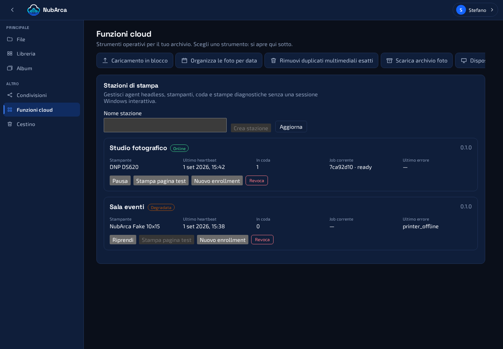

# NubArca Print Agent

The Print Agent is a headless Windows Service or Linux simulator that connects
one NubArca Print Station to a printer adapter. It never receives an
owner cookie and cannot browse files: its credential is scoped to heartbeat,
printer reporting, claiming its own jobs, downloading the claimed artifact and
reporting the result.



## Build and package

The manual **Print Agent release** GitHub workflow runs only on `main`, tests
the agent and publishes a self-contained `win-x64`, `win-arm64` or `linux-x64` artifact. The
artifact contains the executable, runtime, configuration defaults, install and
uninstall scripts, the source commit and an executable SHA-256 checksum. No
.NET runtime installation is required on the station.

For a local package equivalent to CI:

```powershell
dotnet publish src/NubArca.PrintAgent/NubArca.PrintAgent.csproj `
  --configuration Release --runtime win-x64 --self-contained true `
  --output .\artifacts\print-agent
```

## Linux fake simulator

The `linux-x64` bundle runs the real station protocol with the `fake` adapter:
it enrolls, heartbeats, claims jobs, downloads artifacts, journals submission
and acknowledges the result, then copies the rendered artifact to a private
`fake-output` directory. It never contacts a physical printer or CUPS.

Extract the bundle in the agent installation directory. From its `linux/`
directory, for every simulator create a station in **Cloud functions → Print
stations**, then run:

```bash
sudo ./install-fake-instance.sh --instance sim-sala \
  --server https://your-nubarca-origin.example \
  --station 00000000-0000-0000-0000-000000000000
```

The script prompts silently for the one-shot token and passes that instance's
JSON configuration explicitly to both enrollment and systemd runtime. Each
instance has a unique Unix account, mode-0700 state directory, mode-0600
credential, SQLite journal and output directory under
`/var/lib/nubarca-print-agent/<instance>`. The shared configuration directory
is root-owned and traversable; each instance JSON remains readable only by root
and that instance's group. Repeat
with `sim-lab` and `sim-test`. Check it with
`systemctl status nubarca-print-agent@sim-sala`; its fake pages are in that
instance's `fake-output` directory. `uninstall-instance.sh` retains state by
default; `--purge-state` is only for intentional station replacement.

`cups` is an explicit reserved adapter contract, not a fallback and not yet an
implementation. A future CUPS adapter must retain this same journal boundary;
until physical acceptance exists, Linux uses only `fake` and DS620 remains the
Windows-spooler path.

## Windows enroll and install

1. In **Cloud functions → Print stations**, create a station. NubArca displays
   the enrollment token once and keeps only its SHA-256 digest.
2. Download the workflow artifact onto the dedicated Windows print PC and
   extract it to its final directory, for example
   `C:\Program Files\NubArca\PrintAgent`.
3. In an elevated PowerShell in that directory run:

```powershell
.\install-service.ps1 `
  -ServerOrigin https://your-nubarca-origin.example `
  -StationId 00000000-0000-0000-0000-000000000000 `
  -EnrollmentToken ONE_SHOT_TOKEN `
  -PrinterName 'DNP DS620'
```

The script writes non-secret configuration beside the service, exchanges the
short-lived token for a distinct station credential, stores that credential
with machine-scope Windows DPAPI under `%ProgramData%\NubArca\PrintAgent`, and
starts the service with the Windows Print Spooler dependency. The token cannot
be used again. Create a new enrollment from the dashboard if it expires.

Revoking a station invalidates its credential immediately. Pausing it preserves
heartbeat/status but stops new claims. Uninstall preserves the encrypted
credential and journal unless `-PurgeLocalState` is explicitly supplied:

```powershell
.\uninstall-service.ps1
```

## Delivery safety

The server renders immutable, bounded artifacts before making a job claimable.
One conditional database update grants a time-limited claim. Immediately before
calling the Windows driver, the agent durably records `submitting` in a local
SQLite journal. It retries a missing server acknowledgement without printing a
second copy. If the process dies or the adapter throws after that boundary, it
reports `delivery-unknown`; an owner must decide what to do next. It never
automatically retries an ambiguous physical submission.

Temporary artifacts are size bounded. Files required by an unacknowledged
journal entry are retained; older unreferenced files are reclaimed. Operational
messages contain job short identifiers and error classes, not credentials,
enrollment tokens or image bytes.

## Party guest prints

A party guest's keepsake is an ordinary print job to this agent. It arrives with
the same `10x15` format, the same claim lease, the same artifact download and
the same terminal report as an owner test page; the agent neither knows nor
needs to know that a guest composed it. Everything party-specific — which
capability token was held, which photographs were chosen, how they were cropped,
which budget the sheet was charged to — is resolved and spent **server-side
before the job becomes claimable**, so no agent-side change was needed to
support the feature and none is needed to secure it.

Two job kinds distinguish the compositions:

| Kind | Sheet | What comes out |
|---|---|---|
| `party-photo` | 10×15, following the photograph's own orientation | one framed photograph with the party footer |
| `party-strip4` | 10×15 portrait | four different photographs, printed as **two identical strips** side by side, with cut ticks at the ends of the gutter |

Both are one sheet of the same paper: the strip is a composition, not a second
media size, so a station qualified for 10×15 is qualified for both. Operators
sizing consumables should note that the products carry **separate budgets** on
the server — a party out of photo prints can still be printing strips — and that
each accepted job is numbered per party, which is the number a guest is shown
and reads out at the desk.

Party artifacts are rendered by the server from the owner's originals and are
subject to the same bounded-artifact and retention rules as any other job; the
agent stores no party state and holds no party token.

## Printer adapters and DS620

| Path | Discovery | 10x15 capability | Submission | Validated here |
|---|---|---|---|---|
| `fake` | one deterministic virtual printer | yes | copies the artifact to a bounded local test directory | automated |
| `windows-spooler` | installed Windows queues, optionally restricted by exact printer name | derived from driver paper sizes near 4×6 inches | silent `PrintDocument` through the installed driver | contract/build only |
| DNP DS620 via Windows spooler | queue name and driver supplied by the operator | requires the installed driver to expose 4×6 / 10×15 media | same generic spooler path | **manual hardware acceptance pending** |

The DS620 path has no vendor SDK assumption. Install the DNP Windows driver,
configure the intended 10×15 media and run **Stampa pagina test**. Acceptance
requires: station online, DS620 shown ready, one physical page, correct crop and
orientation, and the remote job reaching completed. Driver/USB/paper errors
must instead make the station degraded or the job failed/unknown.

### Physical acceptance matrix

Do not mark DS620 support as verified until one dated test record covers every
row below on the target Windows/driver combination:

| # | Check | Expected evidence |
|---:|---|---|
| 1 | Windows recognises the DS620 | Installed spooler queue is ready |
| 2 | Agent discovery | Dashboard names the same device and model |
| 3 | 10×15 capability | Driver paper sizes make the test action available |
| 4 | Diagnostic page | Exactly one complete 10×15 page; job completes remotely |
| 5 | Portrait owner photo | Correct EXIF orientation and deterministic contain/pad |
| 6 | Landscape owner photo | Correct EXIF orientation and deterministic contain/pad |
| 7 | USB disconnect | Device/station becomes degraded without a false completion |
| 8 | USB reconnect | Heartbeat rediscovers the queue without re-enrollment |
| 9 | Printer power cycle | Offline/degraded then ready after recovery |
| 10 | Pause station | Heartbeat continues and no new job is claimed |
| 11 | Resume station | The existing ready job is claimed once |
| 12 | Restart with a Ready job | Job is subsequently claimed once |
| 13 | Restart after durable Submitting | No automatic second submission; outcome is reconciled or unknown |
| 14 | Network loss after spool acceptance | ACK is retried, physical submission is not |
| 15 | Copy count audit | Spooler/output count proves no duplicate page |

Record the Windows version, DNP driver version, agent artifact version/source
commit, printer firmware, media and result for each row. The automated fake
adapter proves protocol semantics only; it is not evidence for these rows.

## Recovery and diagnostics

- Service state: `Get-Service NubArcaPrintAgent`.
- Logs: Windows Event Viewer → Windows Logs → Application.
- Server state: Cloud functions → Print stations shows derived online/degraded/
  offline status, printers, queue depth, current job and the last bounded error.
- A missing printer in the latest heartbeat is marked offline rather than
  preserving an old ready observation.
- Do not delete `journal.db` to solve a stuck delivery: it is the evidence that
  prevents duplicate physical prints. Revoke/re-enroll only when intentionally
  replacing the station credential.
