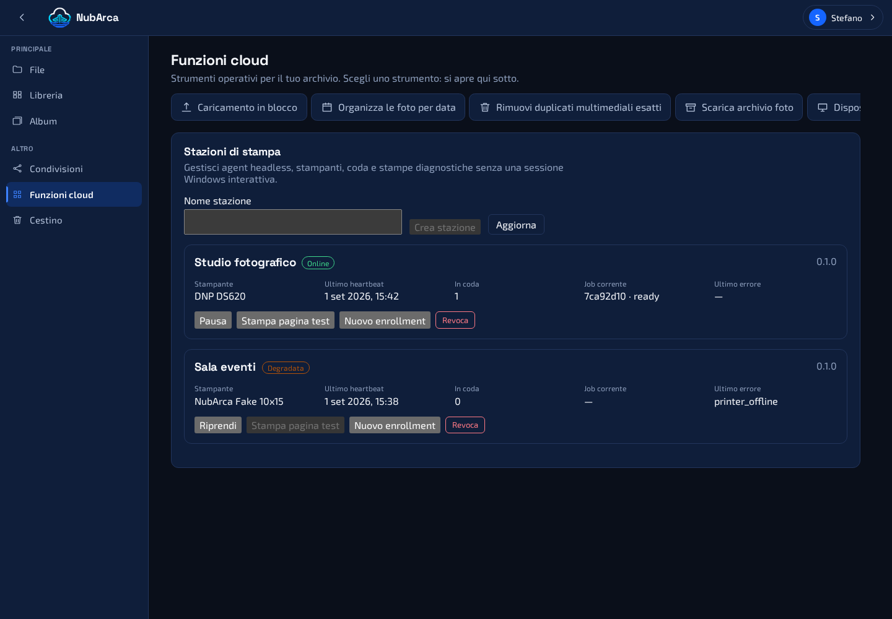

# NubArca Print Agent

The Print Agent is a headless Windows Service, Linux Print Box or Linux
simulator that connects one NubArca Print Station to a printer adapter. It never receives an
owner cookie and cannot browse files: its credential is scoped to heartbeat,
printer reporting, claiming its own jobs, downloading the claimed artifact and
reporting the result.



## Build and package

The manual **Print Agent release** GitHub workflow runs only on `main`, tests
the agent and publishes a self-contained `win-x64`, `win-arm64` or `linux-x64` artifact. The
artifact contains the executable, runtime, configuration defaults, install and
uninstall scripts, the source commit and an executable SHA-256 checksum. No
.NET runtime installation is required on the station.

For a local package equivalent to CI:

```powershell
dotnet publish src/NubArca.PrintAgent/NubArca.PrintAgent.csproj `
  --configuration Release --runtime win-x64 --self-contained true `
  --output .\artifacts\print-agent
```

## Linux fake simulator

The `linux-x64` bundle runs the real station protocol with the `fake` adapter:
it enrolls, heartbeats, claims jobs, downloads artifacts, journals submission
and acknowledges the result, then copies the rendered artifact to a private
`fake-output` directory. It never contacts a physical printer or CUPS.

Extract the bundle in the agent installation directory. From its `linux/`
directory, for every simulator create a station in **Cloud functions → Print
stations**, then run:

```bash
sudo ./install-fake-instance.sh --instance sim-sala \
  --server https://your-nubarca-origin.example \
  --station 00000000-0000-0000-0000-000000000000
```

The script prompts silently for the one-shot token and passes that instance's
JSON configuration explicitly to both enrollment and systemd runtime. Each
instance has a unique Unix account, mode-0700 state directory, mode-0600
credential, SQLite journal and output directory under
`/var/lib/nubarca-print-agent/<instance>`. The shared configuration directory
is root-owned and traversable; each instance JSON remains readable only by root
and that instance's group. Repeat
with `sim-lab` and `sim-test`. Check it with
`systemctl status nubarca-print-agent@sim-sala`; its fake pages are in that
instance's `fake-output` directory. `uninstall-instance.sh` retains state by
default; `--purge-state` is only for intentional station replacement.

A real printer on Linux uses the `cups` adapter and is installed as a Print Box
(below), never through this simulator installer.

## Windows enroll and install

1. In **Cloud functions → Print stations**, create a station. NubArca displays
   the enrollment token once and keeps only its SHA-256 digest.
2. Download the workflow artifact onto the dedicated Windows print PC and
   extract it to its final directory, for example
   `C:\Program Files\NubArca\PrintAgent`.
3. In an elevated PowerShell in that directory run:

```powershell
.\install-service.ps1 `
  -ServerOrigin https://your-nubarca-origin.example `
  -StationId 00000000-0000-0000-0000-000000000000 `
  -EnrollmentToken ONE_SHOT_TOKEN `
  -PrinterName 'DNP DS620'
```

The script writes non-secret configuration beside the service, exchanges the
short-lived token for a distinct station credential, stores that credential
with machine-scope Windows DPAPI under `%ProgramData%\NubArca\PrintAgent`, and
starts the service with the Windows Print Spooler dependency. The token cannot
be used again. Create a new enrollment from the dashboard if it expires.

Revoking a station invalidates its credential immediately. Pausing it preserves
heartbeat/status but stops new claims. Uninstall preserves the encrypted
credential and journal unless `-PurgeLocalState` is explicitly supplied:

```powershell
.\uninstall-service.ps1
```

## Delivery safety

The server renders immutable, bounded artifacts before making a job claimable.
One conditional database update grants a time-limited claim. Immediately before
calling the Windows driver, the agent durably records `submitting` in a local
SQLite journal. It retries a missing server acknowledgement without printing a
second copy. If the process dies or the adapter throws after that boundary, it
reports `delivery-unknown`; an owner must decide what to do next. It never
automatically retries an ambiguous physical submission.

Temporary artifacts are size bounded. Files required by an unacknowledged
journal entry are retained; older unreferenced files are reclaimed. Operational
messages contain job short identifiers and error classes, not credentials,
enrollment tokens or image bytes.

## Party guest prints

A party guest's keepsake is an ordinary print job to this agent. It arrives with
a paper format — `10x15`, `13x18` or `20x15` — or `2x6x2` (below), the same claim lease, the same artifact download and
the same terminal report as an owner test page; the agent neither knows nor
needs to know that a guest composed it. Everything party-specific — which
capability token was held, which photographs were chosen, how they were cropped,
which budget the sheet was charged to — is resolved and spent **server-side
before the job becomes claimable**, so no agent-side change was needed to
support the feature and none is needed to secure it.

**The paper and the product are two different things.** The paper is the one
loaded in the printer, and the OPERATOR says which on the Print stations page:
a dye-sublimation printer takes one roll at a time, and neither its Windows
driver nor Gutenprint reports which in a form worth trusting. It is one of
three, the photo trade names of DNP's media — `10x15` (4×6"), `13x18` (5×7")
and `20x15` (6×8", which lies as it is named). The agent reports which of them
the printer can print; the server offers guests only what the loaded paper can
make, and only if the agent reports that paper:

| Paper | Photo | 4 photos | Two strips of 4 |
|---|---|---|---|
| 10×15 | yes | yes | yes, when the printer cuts (`2x6x2`) |
| 13×18 | yes | yes | no |
| 20×15 | yes | yes | no |

A sheet is sent as its paper's format, and **the server hands a printer only
the sheets its loaded paper can take**: a claim skips a job made for another
paper (`2x6x2` counts as 10×15), which stays `ready` in the queue until that
paper is loaded again, then prints in its turn. The Print stations page lists it
as *waiting for 13×18 paper* (or whichever), and the guest's phone says the
staff need to change the paper, so a roll changed mid-queue never prints a
sheet on the wrong media. An agent that does not know a paper still refuses its
job with `format_unsupported` and prints nothing else instead — the last line of
defence, not the first. A guest who composed for one paper while the operator
loaded another is told so, and nothing is printed or spent.

Three job kinds distinguish the compositions:

| Kind | Sheet | What comes out |
|---|---|---|
| `party-photo` | the loaded paper, following the photograph's own orientation unless the guest turns it | one framed photograph with the party footer — or, in the *On the photo* look, the untouched photograph to the edges with the party's name, host's line and number on it in white, black or red (over a faint support that starts just above the words) and the NubArca symbol, chosen separately: the brand's light or dark flat mark in its own colours |
| `party-grid4` | the loaded paper, as it is named: standing on 10×15 and 13×18, lying on 20×15 | **four** different photographs, two by two (1 top left, 2 top right, 3 and 4 below), each with its own crop, and one footer; nothing to cut |
| `party-strip4` | 10×15 portrait, sent as `2x6x2` | the twin strip: **eight** different photographs as **two strips of four**, 1–4 on the left and 5–8 on the right, cut in two by the printer. It exists only on 10×15 and only on a printer that reports `2x6x2`; a printer that cannot cut has no strips at all, and no sheet carries cut marks |

Cutting is an extra on top of 10×15, never a substitute for it: a printer
reporting only `2x6x2` opens no party printing at all. Operators sizing
consumables should note that the products carry **separate budgets** on the
server — a party out of photo prints can still be printing strips — and that one
sheet is one unit, whatever comes off it (the twin strip is one sheet), and
each accepted job is numbered per party, which is the number a guest is shown
and reads out at the desk.

The agent learns the larger papers only from **version 0.4**. An older agent
reports 10×15 alone, so a printer it drives offers nothing on 13×18 or 20×15
until the agent is updated — which the Print stations page says beside the
paper selector.

Party artifacts are rendered by the server from the owner's originals and are
subject to the same bounded-artifact and retention rules as any other job; the
agent stores no party state and holds no party token.

## Lending a printer

A printer's owner can lend **one printer** — not the whole station — to another
NubArca account, by that account's email, from the *Sharing* section under the
printer on the Print stations page. Several people can borrow the same printer
at once. Nothing changes on the agent: a lent printer is the same queue, and no
agent update is needed.

What the borrower gets, under *Printers shared with you*: that printer and
nothing else of the owner's — its name, its station's name and status, the
paper in it, whose it is ("shared by …") and how many of the loan's sheets they
have used. They may:

- **set the loaded paper**, because they are the one standing at the printer
  when they change the roll. Every change records who and when; the paper
  selector shows it to both, and it is audited (`print.printer.paper.set`);
- **print a test page**, which counts against the loan's ceiling;
- **choose it for their parties**, where it is offered beside their own
  printers as "shared by …". Their guests print on it under their party's own
  budgets, as on any printer.

Colours, pause and resume, enrolment, revoking the station and the loans
themselves stay the owner's.

**The ceiling** is optional, from 1 to 5000 sheets, one number per loan (not
per party or per paper). It counts every sheet the printer accepted for this
loan: guest prints and test pages, whether or not they have come out yet. It
can be raised or lowered, never below what is already used. When it is reached,
the borrower's parties stop accepting new prints (the guest is told the printer
has no sheets left, not that the party has run out) and the test page is
disabled. Lending the printer again later starts a new loan and a new count.

**Ending a loan** accepts nothing new from that moment, including a guest who
was composing: what is already in the queue still prints. Revoking the station
ends every loan of its printers in the same step, and each is audited as a loan
ending with `station_revoked`. While either account is disabled the loan takes
no sheet. The loan's standing — the share, its station, both accounts, the
ceiling — is checked by the same database statement that takes the sheet, so a
revoke that lands while a guest is pressing *Print* is never outrun. A guest
keeps following a sheet already accepted after the loan ends or runs out, or
the party's printing closes, but only through their own party's print link,
and not once that link is revoked or expired. The owner sees the
whole queue with who sent each sheet, and can cancel any sheet that has not
reached the printer, a borrower's included. A borrower can resend a failed sheet
of theirs only while the loan is live; the owner always can.

**Sheets per person**, under each printer, is the owner's summary across the
printer's whole history and across every loan: sheets accepted and sheets
printed per person, per paper, and whether they were party prints, album prints
or test pages. It counts sheets, never shows what was on them, and is meant to
settle up with whoever borrowed the printer.

Loans are audited as `print.printer.share.create`, `.update` and `.revoke`.

## DNP DS-RX1HS: strips cut by the printer

The DS-RX1HS can cut a 4×6 print down the middle into two 2×6 strips. That is a
driver option, **2inch cut**, not a paper size — so the agent uses a second
Windows queue on the same printer whose defaults have it enabled, and sends
strip sheets there as format `2x6x2`. Photos keep going to the ordinary queue,
uncut. The artifact is identical either way: the same 10×15 portrait sheet with
two strips side by side; only the queue differs, and the server leaves out the
cut ticks, which would otherwise sit exactly under the blade.

The cut needs a DNP driver and printer firmware recent enough to offer it
([DNP: how to enable 2" cuts in Windows](https://dnpphoto.com/Portals/0/Resources/FAQ_17_DS_HowToEnable2InchCutsInWindows.pdf)).

1. Install the DNP driver and check that the ordinary queue (for example
   `DNP DS-RX1HS`) prints a 4×6 test page.
2. **Add a second printer** on the same port with the same driver, named for
   example `DNP DS-RX1HS 2inch`.
3. On that second queue open **Printer properties → Advanced → Printing
   Defaults…** (not *Printing preferences*: those are per user, and the agent
   runs as `LocalSystem`, which sees only the defaults). Set paper size **4×6**,
   then **Advanced… → Document Options → Printer Features → 2inch cut: Enable**.
4. Configure the agent with both names — at install time
   `-PrinterName 'DNP DS-RX1HS' -StripPrinterName 'DNP DS-RX1HS 2inch'`, or on
   an existing installation by adding `"StripPrinterName"` beside
   `"PrinterName"` in `appsettings.Production.json` and running
   `Restart-Service NubArcaPrintAgent`.
5. In **Cloud functions → Print stations** the printer now reads **Strips: Cut
   by the printer (2×6)**. It reads *One sheet, cut by hand* when the second
   queue is missing, invalid or has no 4×6 paper — nothing is ever advertised
   as cut that the agent cannot route to a cutting queue.

`StripPrinterName` requires `PrinterName`, and must be a different queue: the
agent refuses to start otherwise, because without a named printer it would
report every installed queue — the cutting one included — as a printer of its
own. Only the configured printer can report `2x6x2`, and a `2x6x2` job reaching
any other printer, or this one after its cutting queue was removed, fails as
`format_unsupported` rather than printing one uncut sheet.

On both queues the agent prefers the queue's own **default** 4×6 paper entry
over the first 4×6-sized entry it finds, so what an operator set on a queue is
not undone by a different entry of the same size. It turns the page relative to
that entry's own definition, not to the picture alone: the DS-RX1 driver defines
4×6 lying down (6 wide, 4 tall), so a portrait sheet — every strip pair — is
sent turned, and the cut falls between the two strips.

Physical acceptance, in addition to the matrix below: one strip job comes out as
two separate 2×6 strips with the cut in the gutter, no tick visible on either
edge, and the job completed remotely; a photo job on the same station comes out
uncut.

## Linux Print Box (CUPS + Wi-Fi setup)

A small Linux computer with no screen or keyboard, a USB cable to the DNP
DS-RX1/RX1HS and one Wi-Fi adapter becomes a print station you carry to an
event. NubArca never drives the printer or the radio itself: **CUPS** with
**Gutenprint** prints, **NetworkManager** does the networking, and the agent
only decides which queue a sheet goes to and when the box offers its own
setup network.

```text
power on ──> Ethernet or a known Wi-Fi within 30 s? ──yes──> print
                          │ no
                          v
            setup Wi-Fi  NubArca-Print-XXXX  ──> phone opens the setup page
                          │                         picks a network, types the password
                          v
               joins that network ── fails? ──> the setup Wi-Fi comes back
```

### Requirements

- **Ubuntu Server 24.04 LTS or later** (recommended; 26.04 LTS works) or
  **Debian 12 or later**, minimal, x86-64 (`linux-arm64` is a later target;
  nothing here is Intel-specific). No desktop. The installer refuses anything
  older: it needs polkit's JavaScript rules.
- A Wi-Fi adapter that supports access-point mode (`iw list`, *Supported
  interface modes*, lists `AP`). One adapter is enough.
- Ethernet while installing: packages and enrollment need the network.
- The DNP plugged in over USB and switched on, so its queues can be created.

### Install

Three commands and two answers; nothing else is done by hand.

1. In **Cloud functions → Print stations** create a **new** station and keep
   its id and one-shot token on screen (the token lasts 10 minutes).
2. Copy the `linux-x64` bundle to the box and extract it (Ubuntu Server has
   Python; no extra package needed):

   ```bash
   sudo python3 -m zipfile -e nubarca-print-agent-<version>-linux-x64.zip /opt/nubarca-print-agent
   ```

3. Run, as root:

   ```bash
   sudo bash /opt/nubarca-print-agent/linux/install-print-box.sh \
     --server https://your-nubarca-origin.example \
     --station 00000000-0000-0000-0000-000000000000
   ```

   It answers two questions silently — the **setup Wi-Fi password** (8–63
   characters) and the **enrollment token** — and then, by itself:

   - installs `cups`, `printer-driver-gutenprint`, `network-manager`,
     `dnsmasq-base`, `avahi-daemon`, `polkitd`, `iw`, ICU and CA certificates;
   - finds the DNP on USB and creates both print queues (next section);
   - names the machine `nubarca-print` (`--hostname`, `--keep-hostname`);
   - installs `nubarca-print-agent@box` under its own account
     `nubarca-print-box`, with the polkit rule below;
   - on Ubuntu Server, hands every network interface from systemd-networkd to
     NetworkManager — one netplan file, `99-nubarca-network-manager.yaml`,
     keeping each interface's DHCP or static settings — as the very last step,
     ten seconds after it finishes. An SSH session may pause or drop then;
     reconnect to the same address.

   It is idempotent: run the same command again after plugging the printer in,
   or to change the setup password; the station is enrolled only once
   (`--reenroll` replaces the credential on purpose). `--open-setup-network`
   leaves the setup Wi-Fi open — for a first test only, and logged as a
   warning. `--no-network-provisioning` is for a box that only ever uses a wired
   or already-configured network, and leaves its network configuration alone.

   On Debian, an interface configured in `/etc/network/interfaces` stays with
   ifupdown and NetworkManager cannot use it; the installer warns. Ubuntu Server
   has no such file.

The agent does **not** run as root. The installer grants its account exactly the
NetworkManager actions it needs through a polkit rule
(`/etc/polkit-1/rules.d/49-nubarca-print-box.rules`: network control, system
connection profiles, Wi-Fi scan, Wi-Fi sharing) — no sudo, no other service.
Printing needs no privilege at all: any local account may submit to CUPS.

### The two CUPS queues

Both point at the same printer and the same 4×6 media; they differ only in the
cut. The installer creates them with `NubArca.PrintAgent setup-cups`; at run
time the agent only chooses a queue, the queues carry their settings.

| Queue | Media | 2-inch cut | Receives |
|---|---|---|---|
| `NubArca-RX1HS` | the loaded roll | **off** | every paper (`10x15`, `13x18`, `20x15`) |
| `NubArca-RX1HS-STRIP` | 4×6 / 10×15 | **on** | party strips (`2x6x2`) |

The photo queue's default page size stays `w288h432` (4×6), and a 10×15 job
goes out exactly as it always has. A `13x18` job names `-o PageSize=w360h504`
(5×7) and a `20x15` job `-o PageSize=w432h576` (6×8). The agent reports those
two papers only while the queue's driver lists those sizes (`lpoptions -l`,
read once every ten minutes).

`setup-cups` takes the printer's **Gutenprint dye-sub** device
(`gutenprint53+usb://dnp-dsrx1/…`, plain `usb://` only as a last resort) and
Gutenprint's DS-RX1 driver (the *expert* PPD, which lists every page size),
and gives the photo queue Gutenprint's `w288h432` (4×6) and the strip queue
its `w288h432-div2` — Gutenprint's "2x6*2": the same 4×6 sheet, cut in two by
the printer ([Gutenprint discussion](https://sourceforge.net/p/gimp-print/discussion/4358/thread/936fafa9/)).
Both queues **retry** a job while the printer is unplugged instead of stopping
— a stopped queue would wait for an operator the box does not have — and
neither is shared on the network.

It only chooses sizes the installed driver actually lists. If the cut size is
missing, the strip queue is removed rather than left printing strips uncut, and
the box offers no strips, like any printer that cannot cut. `--no-cups-setup` leaves existing queues untouched; `--printer` and
`--strip-printer` change the names (letters, digits, dot, dash, underscore).

To check a queue by hand: `lp -d NubArca-RX1HS -o fit-to-page photo.jpg` prints
one uncut sheet, the same on `NubArca-RX1HS-STRIP` two strips.

### Wi-Fi setup from a phone

- **At boot** NetworkManager gets `ConnectionGraceSeconds` (30) to use Ethernet
  or a known Wi-Fi. A usable connection — an address and a default route — means
  no setup network, whether or not the NubArca server answers.
- **Otherwise** the box opens `NubArca-Print-XXXX`. XXXX is stable for the box
  (a hash of its machine id); `journalctl -u nubarca-print-agent@box | grep
  'Setup network'` shows it. Join it, then open `http://10.42.0.1:8080` (the
  address NetworkManager usually gives the setup network; the page shows it) or
  `http://nubarca-print.local:8080` where mDNS works.
- **The page** shows the network, the printer, CUPS and whether NubArca is
  reachable, lists the networks the box saw before it opened the setup network,
  and has one form: network name and password. Nothing else — no account, no
  server settings, no logs.
- **Connect**: the setup network closes (one radio), the box tries the network,
  and on success keeps it — the setup network does not come back, which is how
  the phone knows it worked. On **any** failure — wrong password, no address —
  the failed profile is removed and the setup network returns within about a
  minute; the page then says the connection failed.
- **Later**: at the next boot NetworkManager uses the saved network by itself. A
  network lost afterwards gets the same grace period before the setup network
  opens. While the setup network is up and nobody is on the page, the box
  pauses it now and then (after 3 minutes, doubling up to 30) so a router that
  was merely late is found again without a phone.

Security notes: set a setup password for every real installation. The page
accepts a connection request only in setup mode and only as JSON, never logs a
request body, and never returns a password. Passwords reach `nmcli` as separate
arguments, never through a shell; while `nmcli` runs they are visible in the
process list to other local accounts, which a dedicated box does not have.

### Diagnostics

- `systemctl status nubarca-print-agent@box` and
  `journalctl -u nubarca-print-agent@box`: "CUPS available/unavailable",
  "Printer queue missing", "Setup network active", "Wi-Fi connection failed",
  and so on. No password or credential is ever logged.
- `lpstat -l -p`: what the agent reads for printer state (ready, printing,
  offline, error).
- `nmcli device status`: what it reads for the network.
- Without CUPS the printer is reported offline; without NetworkManager the log
  says provisioning is unavailable. Neither stops the agent.

### Physical acceptance

Not verified until one dated record covers, on the RX1HS over USB:

| # | Check | Expected |
|---:|---|---|
| 1 | A `10x15` job | photo queue; one uncut 10×15 |
| 2 | A `2x6x2` job | strip queue; the composite, cut into two strips |
| 3 | `10x15`, `2x6x2`, `10x15`, `2x6x2` | each on its queue; the cutter never touches a photo |
| 4 | USB unplugged | printer offline in the dashboard; no crash |
| 5 | USB plugged back | ready again without restarting the agent |
| 6 | First boot, no known network | `NubArca-Print-XXXX` after about 30 s |
| 7 | Phone joins it, opens the page | status and networks shown |
| 8 | Correct password | setup network gone, box online, station online in NubArca |
| 9 | Reboot | saved network used; no setup network |
| 10 | New place, no known network | setup network after the grace period |
| 11 | Wrong password | setup network back, page says it failed, box still configurable |

## Colour adjustment per printer

Every printer and driver has its own tone response: the same sheet can come out
darker from a DS-RX1 on Gutenprint than from the same printer on Windows. Each
printer in **Cloud functions → Print stations** therefore has **Adjust colours**:
midtones, brightness, contrast and saturation, each a gentle factor around
neutral (midtones 0.6–1.6, brightness and contrast 0.7–1.3, saturation
0.5–1.5; the server refuses anything outside).

The server applies it to the **whole sheet** it renders for that printer —
guest photos, strips and the test page — before the artifact is stored, so it
works the same on every adapter and no agent or driver setting is involved.
It compensates the printer, not the picture: the guest's preview does not
change, and a job already queued keeps the sheet it was rendered with.
*Midtones* is usually the right first control for prints that are too dark or
too light: it moves faces and shadows while black and white stay where they
are.

**Print test page** shows the result: under its text it carries an 11-step grey
wedge from black to white and eight colour and skin patches, rendered with the
printer's adjustment. Adjust, save, print the test page, compare.

Leave the driver's own tone options (for example Gutenprint's `StpGamma`) at
their defaults, or the two corrections add up.

## The simulator takes time, on purpose

`FakeSheetSeconds` (default **10**) is how long the fake printer spends
producing one sheet before it writes the file. A simulator that returns
instantly is a poor model of the thing it stands for: a queue with depth in it,
a guest told how many sheets are ahead of theirs, and a job observably in
`submitting` rather than blinking through it all depend on a sheet taking time.
Automated tests pass `0` and print instantly.

Nothing is written until the sheet is finished, so a run stopped mid-print
leaves no file claiming a print that never happened.

### Connection reuse

The agent talks in short bursts a few seconds apart, through whatever reverse
proxy fronts the installation. A proxy closes an idle keep-alive connection on
its own schedule, and a pooled socket can be dead before the next burst picks it
up — the request then fails in under two milliseconds with "the response ended
prematurely", far too fast to be a network round trip. On one installation that
was ~370 failed cycles an hour, every hour, with a job left `claimed` each time
the failure landed mid-cycle.

`PooledConnectionIdleTimeout` is therefore two seconds: below any poll interval
this agent uses, so a connection is either still warm from the burst it belongs
to or freshly opened. The cost is one handshake per burst. The alternative is
depending on a proxy's timeout being longer than ours, which is not ours to
guarantee.

## Printer adapters and DS620

| Path | Discovery | 10x15 capability | Submission | Validated here |
|---|---|---|---|---|
| `fake` | one deterministic virtual printer | yes | waits `FakeSheetSeconds`, then copies the artifact to a bounded local test directory | automated |
| `windows-spooler` | installed Windows queues, optionally restricted by exact printer name | derived from driver paper sizes near 4×6 inches | silent `PrintDocument` through the installed driver | contract/build only |
| DNP DS620 via Windows spooler | queue name and driver supplied by the operator | requires the installed driver to expose 4×6 / 10×15 media | same generic spooler path | **manual hardware acceptance pending** |
| `cups` (Linux Print Box) | `lpstat -l -p`; only `PrinterName`, the strip queue folded into it; queues created by `setup-cups` | the configured queue exists in CUPS; `2x6x2` while the strip queue exists too | `lp -d <queue> -t NubArca-<job> -o fit-to-page <artifact>` | fake-runner contract; **hardware acceptance pending** |

The DS620 path has no vendor SDK assumption. Install the DNP Windows driver,
configure the intended 10×15 media and run **Stampa pagina test**. Acceptance
requires: station online, DS620 shown ready, one physical page, correct crop and
orientation, and the remote job reaching completed. Driver/USB/paper errors
must instead make the station degraded or the job failed/unknown.

### Physical acceptance matrix

Do not mark DS620 support as verified until one dated test record covers every
row below on the target Windows/driver combination:

| # | Check | Expected evidence |
|---:|---|---|
| 1 | Windows recognises the DS620 | Installed spooler queue is ready |
| 2 | Agent discovery | Dashboard names the same device and model |
| 3 | 10×15 capability | Driver paper sizes make the test action available |
| 4 | Diagnostic page | Exactly one complete 10×15 page; job completes remotely |
| 5 | Portrait owner photo | Correct EXIF orientation and deterministic contain/pad |
| 6 | Landscape owner photo | Correct EXIF orientation and deterministic contain/pad |
| 7 | USB disconnect | Device/station becomes degraded without a false completion |
| 8 | USB reconnect | Heartbeat rediscovers the queue without re-enrollment |
| 9 | Printer power cycle | Offline/degraded then ready after recovery |
| 10 | Pause station | Heartbeat continues and no new job is claimed |
| 11 | Resume station | The existing ready job is claimed once |
| 12 | Restart with a Ready job | Job is subsequently claimed once |
| 13 | Restart after durable Submitting | No automatic second submission; outcome is reconciled or unknown |
| 14 | Network loss after spool acceptance | ACK is retried, physical submission is not |
| 15 | Copy count audit | Spooler/output count proves no duplicate page |

Record the Windows version, DNP driver version, agent artifact version/source
commit, printer firmware, media and result for each row. The automated fake
adapter proves protocol semantics only; it is not evidence for these rows.

## Recovery and diagnostics

- Service state: `Get-Service NubArcaPrintAgent`.
- Logs: Windows Event Viewer → Windows Logs → Application.
- Server state: Cloud functions → Print stations shows derived online/degraded/
  offline status, printers, queue depth, current job and the last bounded error.
- A missing printer in the latest heartbeat is marked offline rather than
  preserving an old ready observation.
- `Agent is not enrolled` after a successful heartbeat/claim means the runtime
  resolved two API-client instances and only one received the station
  credential. Print Agent `0.2.3` makes that client process-wide; do not work
  around this error by renewing enrollment or deleting a credential.
- Do not delete `journal.db` to solve a stuck delivery: it is the evidence that
  prevents duplicate physical prints. Revoke/re-enroll only when intentionally
  replacing the station credential.
